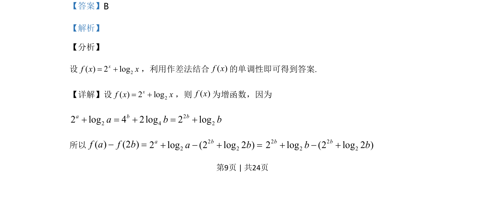
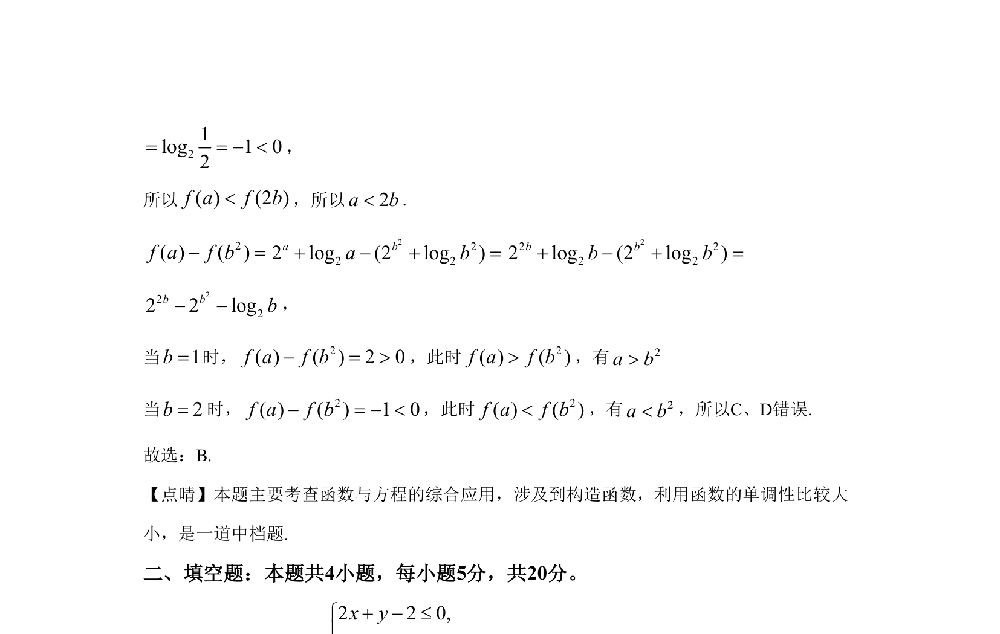

## 题面

## 摘要

构造函数利用单调性比较代数式大小

## 关联考点

- [[函数单调性应用]]
- [[832-对数运算|对数运算]]
- [[构造函数法]]
- [[622-不等式比较|不等式比较]]

## 答案与解析

> 📄 原 PDF 第 9 页：`素材/真题/湖南/2008-2024·（湖南）数学高考真题/2020年高考数学试卷（理）（新课标Ⅰ）（解析卷）.pdf`

<!-- 题干文本-start -->
## 题干文本
12.若 2 42 log 4 2loga ba b+ = +，则（    ）
A. 2a b>B. 2a b<C. 2a b>D. 2a b<
<!-- 题干文本-end -->

<!-- 解析文本-start -->
## 解析文本
【答案】B
【解析】
【分析】
设 2( ) 2 logxf x x= +，利用作差法结合( )f x的单调性即可得到答案.
【详解】设 2( ) 2 logxf x x= +，则( )f x为增函数，因为
22 4 22 log 4 2log 2 loga b ba b b+ = + = +
所以( ) (2 )f a f b- =22 22 log (2 log 2 )a ba b+ - + =2 22 22 log (2 log 2 )b bb b+ - +
.
<!-- 解析文本-end -->
