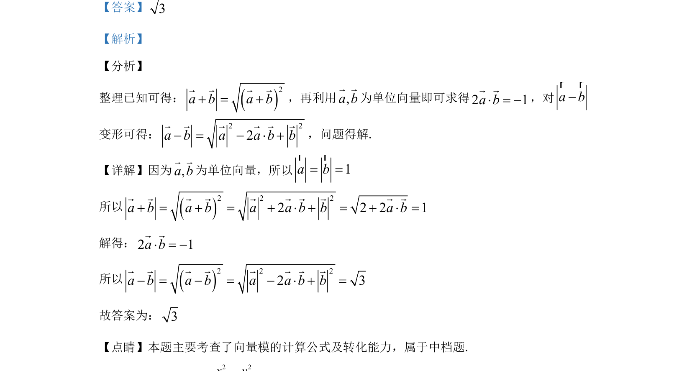

## 题面

## 摘要

考查向量模长公式及单位向量性质，通过已知模长求参数并计算另一模长。

## 关联考点

- [[752-向量模长|向量模长]]
- [[718-单位向量|单位向量]]
- [[328-向量的数量积|向量的数量积]]

## 答案与解析

> 📄 原 PDF 第 11 页：`素材/真题/湖南/2008-2024·（湖南）数学高考真题/2020年高考数学试卷（理）（新课标Ⅰ）（解析卷）.pdf`
