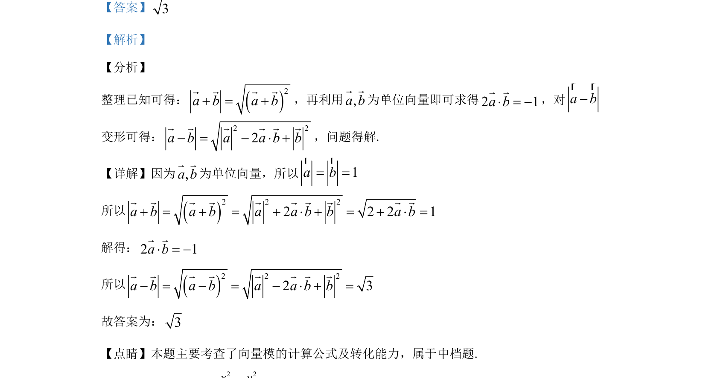

## 题面

## 摘要

考查向量模长公式及单位向量性质，通过已知模长求参数并计算另一模长。

## 关联考点

- [[752-向量模长|向量模长]]
- [[718-单位向量|单位向量]]
- [[328-向量的数量积|向量的数量积]]

## 答案与解析

> 📄 原 PDF 第 11 页：`素材/真题/湖南/2008-2024·（湖南）数学高考真题/2020年高考数学试卷（理）（新课标Ⅰ）（解析卷）.pdf`

<!-- 题干文本-start -->
## 题干文本
14.设,a b为单位向量，且| | 1+ =a b，则| |a b- =______________.
<!-- 题干文本-end -->

<!-- 解析文本-start -->
## 解析文本
【答案】3
【解析】
【分析】
整理已知可得：2a b a b+ = +r r r r
，再利用,a br r
为单位向量即可求得2 1a b× = -r r
，对a b-r r
变形可得：
2 22a b a a b b- = - × +r r r r r r
，问题得解.
【详解】因为,a br r
为单位向量，所以1a b= =r r
所以22 22 2 2 1a b a b a a b b a b+ = + = + × + = + × =r r r r r r r r r r
解得：2 1a b× = -r r
所以22 22 3a b a b a a b b- = - = - × + =r r r r r r r r
故答案为：3
【点睛】本题主要考查了向量模的计算公式及转化能力，属于中档题.
<!-- 解析文本-end -->
