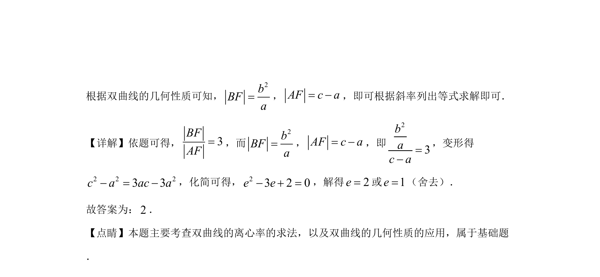

## 题面

## 摘要

利用双曲线的几何性质和斜率关系求离心率。

## 关联考点

- [[1274-双曲线的几何性质|双曲线的几何性质]]
- [[391-椭圆离心率|离心率]]
- [[728-双曲线定义|双曲线定义]]

## 答案与解析

> 📄 原 PDF 第 11 页：`素材/真题/湖南/2008-2024·（湖南）数学高考真题/2020年高考数学试卷（理）（新课标Ⅰ）（解析卷）.pdf`
