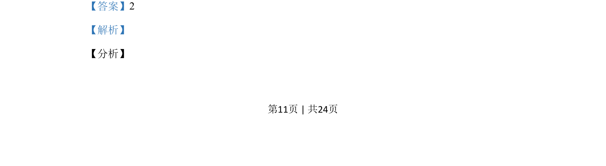
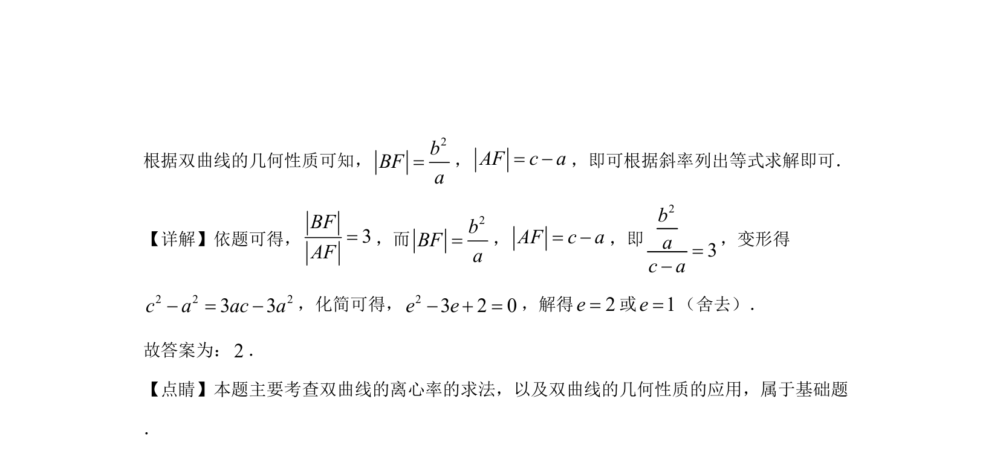

## 题面

## 摘要

利用双曲线的几何性质和斜率关系求离心率。

## 关联考点

- [[367-双曲线几何性质|双曲线的几何性质]]
- [[391-椭圆离心率|离心率]]
- [[730-双曲线的定义|双曲线定义]]

## 答案与解析

> 📄 原 PDF 第 11 页：`素材/真题/湖南/2008-2024·（湖南）数学高考真题/2020年高考数学试卷（理）（新课标Ⅰ）（解析卷）.pdf`

<!-- 题干文本-start -->
## 题干文本
15.已知F为双曲线
2 22 2: 1( 0, 0)x yC a ba b- = > >的右焦点，A为C的右顶点，B为C上的点，且BF
垂直于x轴.若AB的斜率为3，则C的离心率为______________.
<!-- 题干文本-end -->

<!-- 解析文本-start -->
## 解析文本
【答案】2
【解析】
【分析】
的
<!-- 解析文本-end -->
