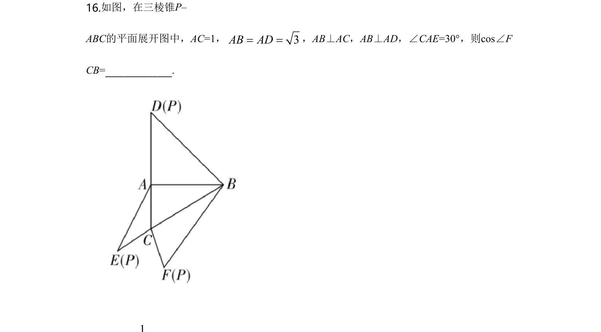
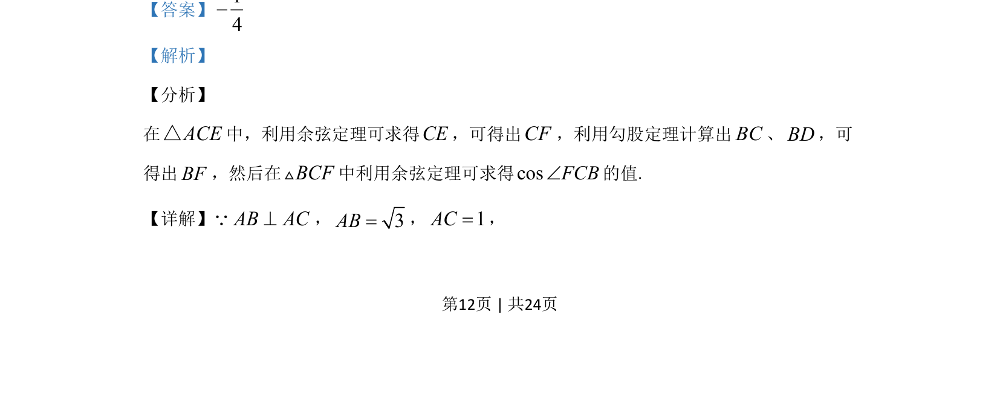
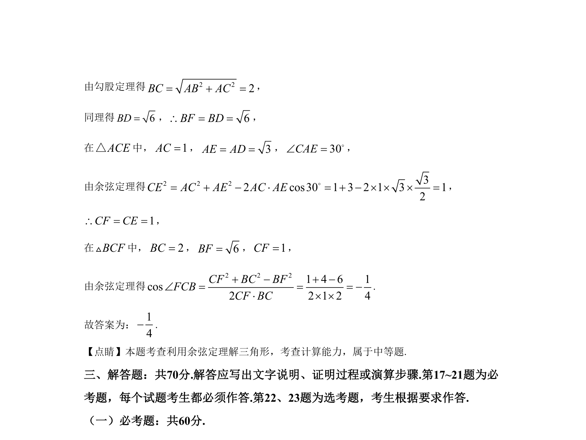

## 题面

## 摘要

本题考查在三角形中应用余弦定理求解边长和角的余弦值。

## 关联考点

- [[126-定理|余弦定理]]
- [[589-解三角形|解三角形]]

## 答案与解析

> 📄 原 PDF 第 12 页：`素材/真题/湖南/2008-2024·（湖南）数学高考真题/2020年高考数学试卷（理）（新课标Ⅰ）（解析卷）.pdf`

<!-- 题干文本-start -->
## 题干文本
16.如图，在三棱锥P–
ABC的平面展开图中，AC=1， 3AB AD= =，AB⊥AC，AB⊥AD，∠CAE=30°，则cos∠F
CB=______________.
<!-- 题干文本-end -->

<!-- 解析文本-start -->
## 解析文本
【答案】14-
【解析】
【分析】
在ACE△中，利用余弦定理可求得CE，可得出CF，利用勾股定理计算出BC、BD，可
得出BF，然后在BCFV中利用余弦定理可求得cosFCBÐ的值.
【详解】AB AC^Q，3AB=，1AC=，
<!-- 解析文本-end -->
