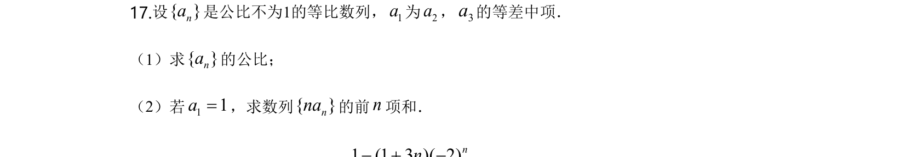
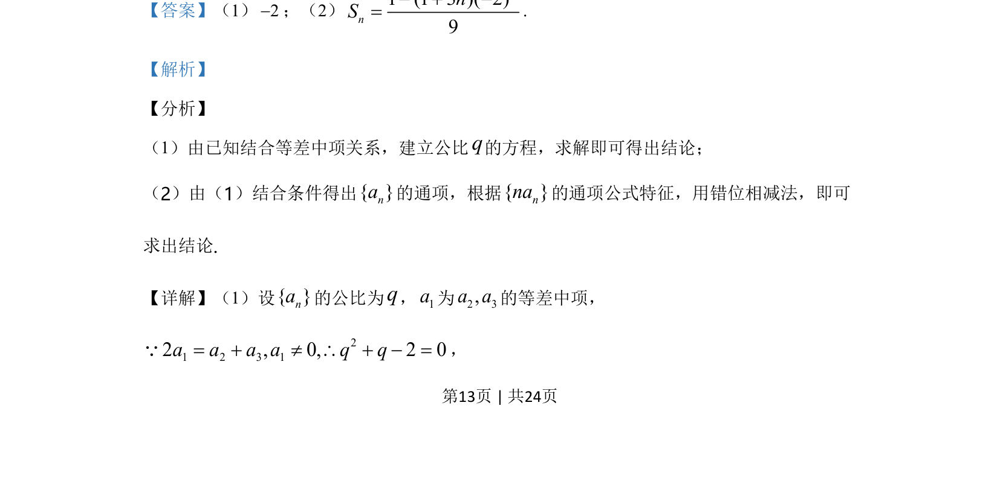
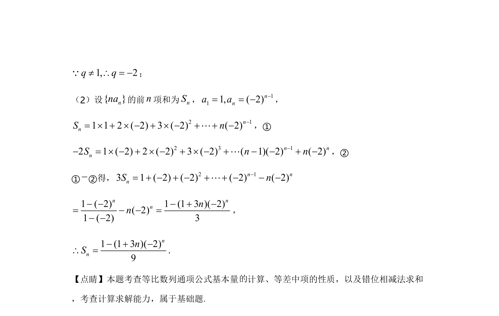

## 题面

## 摘要

考查等比数列通项与等差中项的应用，并用错位相减法求数列{n a_n}的前n项和。

## 关联考点

- [[1067-等比数列的定义与通项公式|等比数列]]
- [[等差中项]]
- [[385-数列错位相减|错位相减法]]
- [[1081-累加求和|数列求和]]

## 答案与解析

> 📄 原 PDF 第 13 页：`素材/真题/湖南/2008-2024·（湖南）数学高考真题/2020年高考数学试卷（理）（新课标Ⅰ）（解析卷）.pdf`
