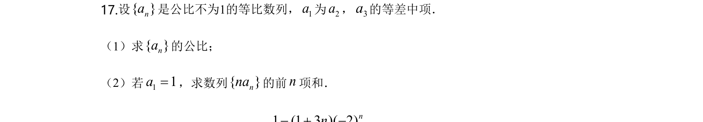
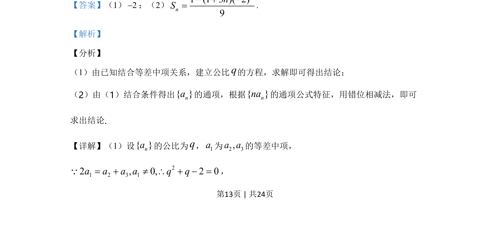
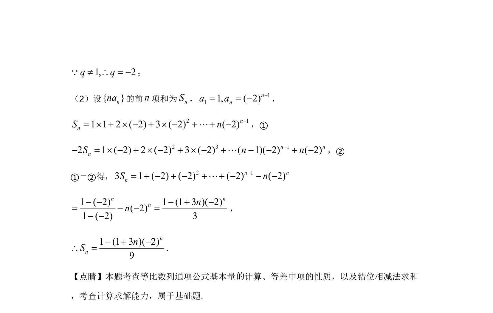

## 题面

## 摘要

考查等比数列通项与等差中项的应用，并用错位相减法求数列{n a_n}的前n项和。

## 关联考点

- [[1067-等比数列的定义与通项公式|等比数列]]
- [[412-等差数列性质|等差中项]]
- [[385-数列错位相减|错位相减法]]
- [[1081-累加求和|数列求和]]

## 答案与解析

> 📄 原 PDF 第 13 页：`素材/真题/湖南/2008-2024·（湖南）数学高考真题/2020年高考数学试卷（理）（新课标Ⅰ）（解析卷）.pdf`

<!-- 题干文本-start -->
## 题干文本
17.设{ }na是公比不为1的等比数列，1a为2a，3a的等差中项．
（1）求{ }na的公比；
（2）若11a=，求数列{ }nna的前n项和．
<!-- 题干文本-end -->

<!-- 解析文本-start -->
## 解析文本
【答案】（1）2-；（2）1 (1 3 )( 2)9nnnS- + -=.
【解析】
【分析】
（1）由已知结合等差中项关系，建立公比q的方程，求解即可得出结论；
（2）由（1）结合条件得出{ }na的通项，根据{ }nna的通项公式特征，用错位相减法，即可
求出结论.
【详解】（1）设{ }na的公比为q，1a为2 3,a a的等差中项，
21 2 3 12 , 0, 2 0a a a a q q= + ¹ \ + - =Q，
<!-- 解析文本-end -->
