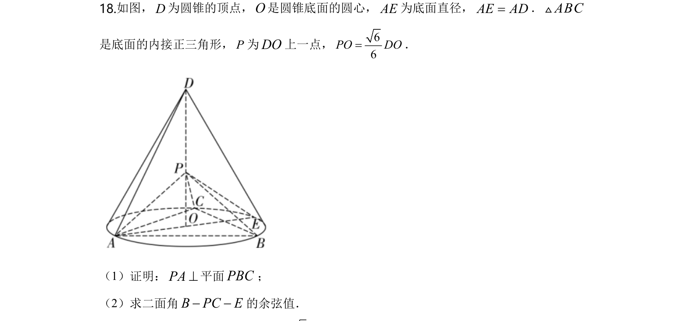
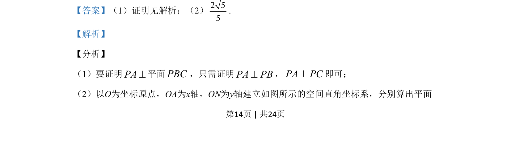
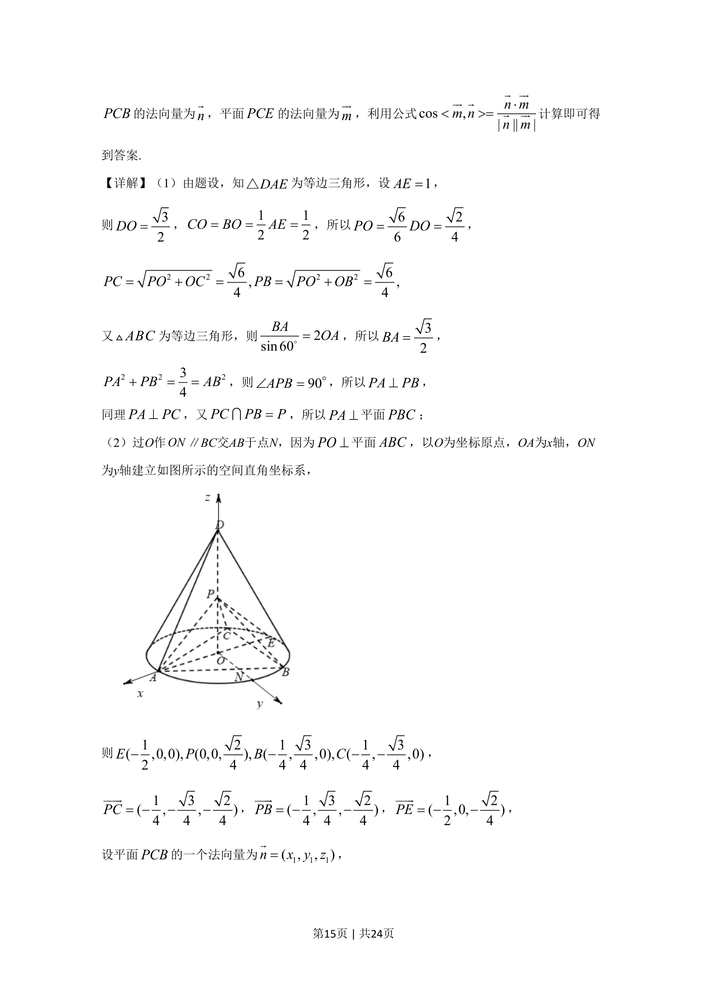
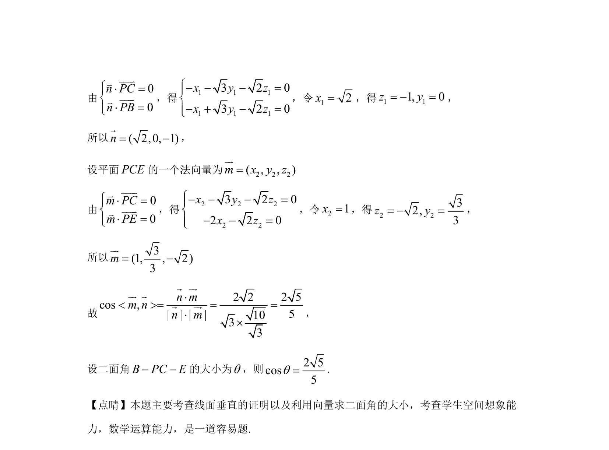

## 题面

## 摘要

立体几何证明线面垂直与二面角的向量法计算

## 关联考点

- [[1355-线面垂直判定|线面垂直判定]]
- [[空间向量法求二面角]]
- [[411-空间平面法向量|法向量]]

## 答案与解析

> 📄 原 PDF 第 14 页：`素材/真题/湖南/2008-2024·（湖南）数学高考真题/2020年高考数学试卷（理）（新课标Ⅰ）（解析卷）.pdf`
