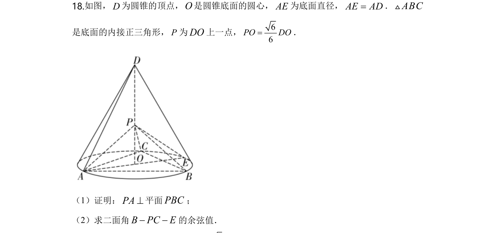
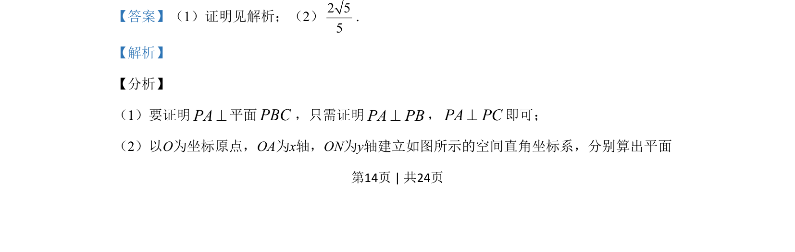
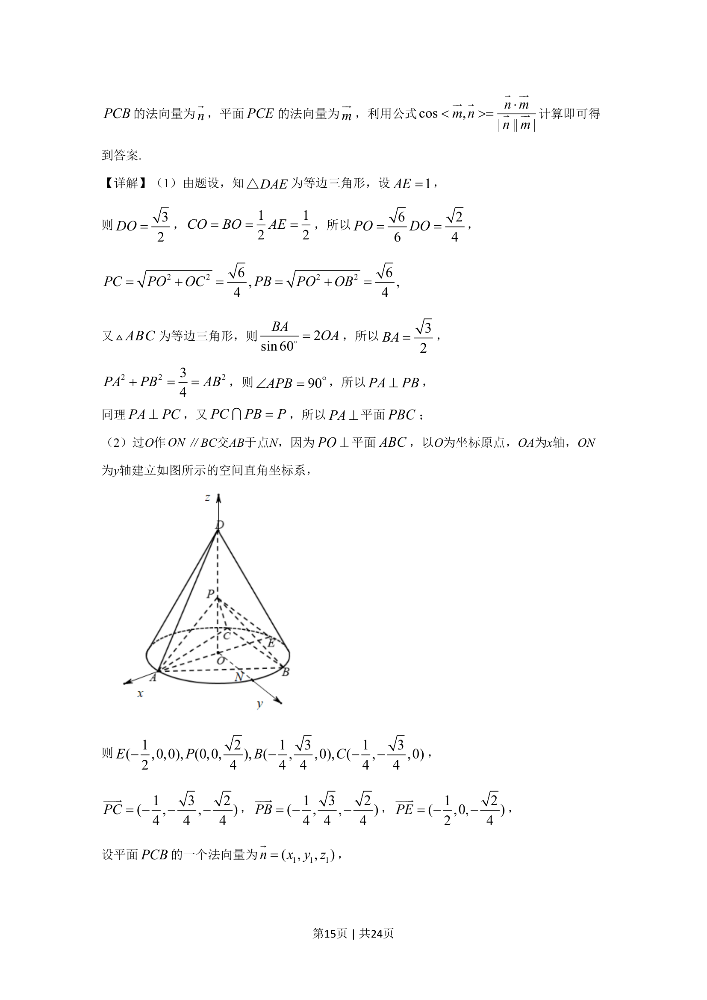
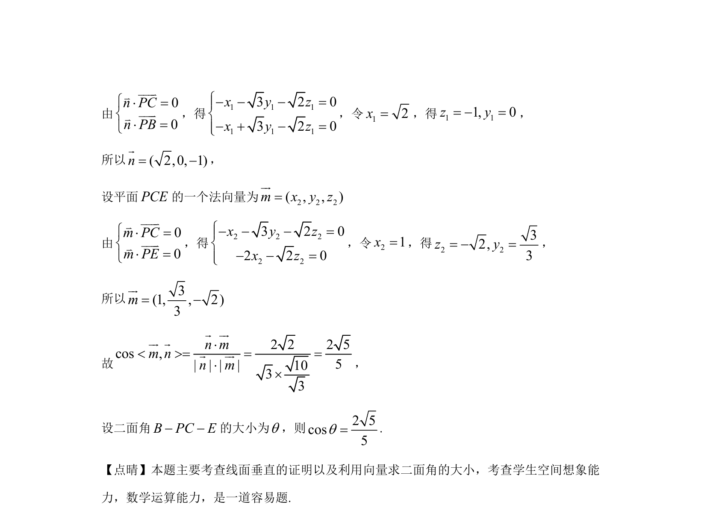

## 题面

## 摘要

立体几何证明线面垂直与二面角的向量法计算

## 关联考点

- [[1085-线面垂直的判定|线面垂直判定]]
- [[空间向量法求二面角]]
- [[411-空间平面法向量|法向量]]

## 答案与解析

> 📄 原 PDF 第 14 页：`素材/真题/湖南/2008-2024·（湖南）数学高考真题/2020年高考数学试卷（理）（新课标Ⅰ）（解析卷）.pdf`

<!-- 题干文本-start -->
## 题干文本
18.如图，D为圆锥的顶点，O是圆锥底面的圆心，AE为底面直径，AE AD=．ABCV
是底面的内接正三角形，P为DO上一点，66PO DO=．
（1）证明：PA^平面PBC；
（2）求二面角B PC E- -的余弦值．
<!-- 题干文本-end -->

<!-- 解析文本-start -->
## 解析文本
【答案】（1）证明见解析；（2）2 55
.
【解析】
【分析】
（1）要证明PA^平面PBC，只需证明PA PB^，PA PC^即可；
（2）以O为坐标原点，OA为x轴，ON为y轴建立如图所示的空间直角坐标系，分别算出平面
的
<!-- 解析文本-end -->
