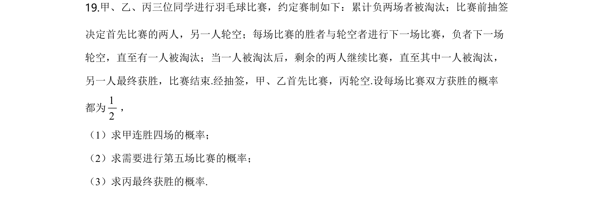
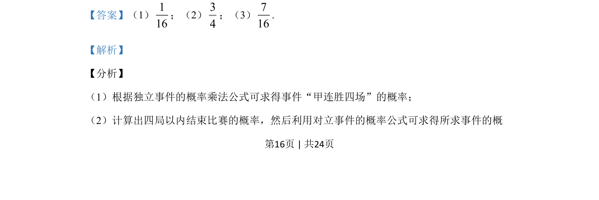
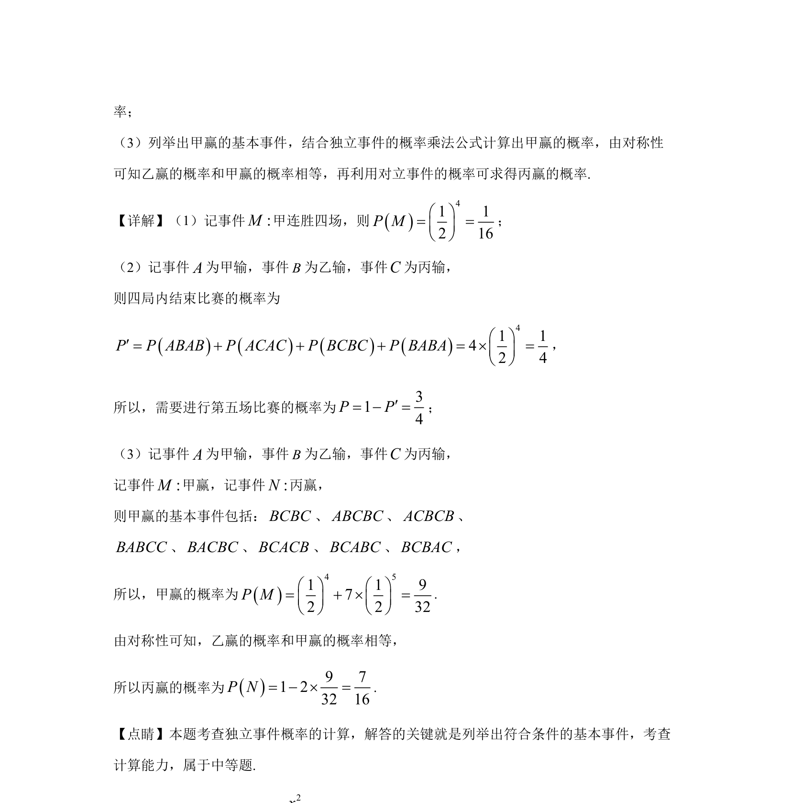

## 题面

## 摘要

本题考查独立事件概率计算，通过列举基本事件结合对立事件与对称性求概率。

## 关联考点

- [[独立事件概率乘法公式]]
- [[对立事件概率]]
- [[703-列举法|列举法]]
- [[834-对称性|对称性]]

## 答案与解析

> 📄 原 PDF 第 16 页：`素材/真题/湖南/2008-2024·（湖南）数学高考真题/2020年高考数学试卷（理）（新课标Ⅰ）（解析卷）.pdf`
