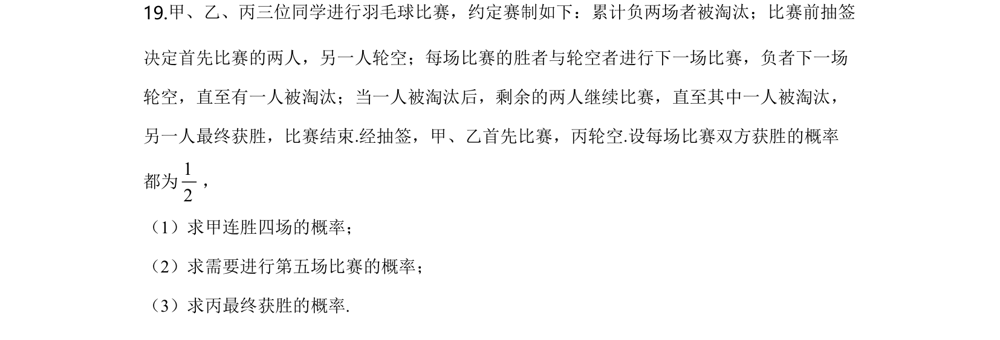
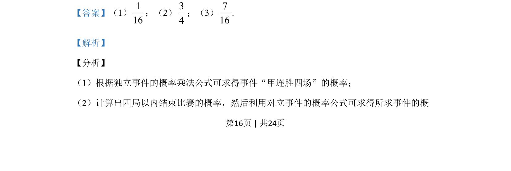
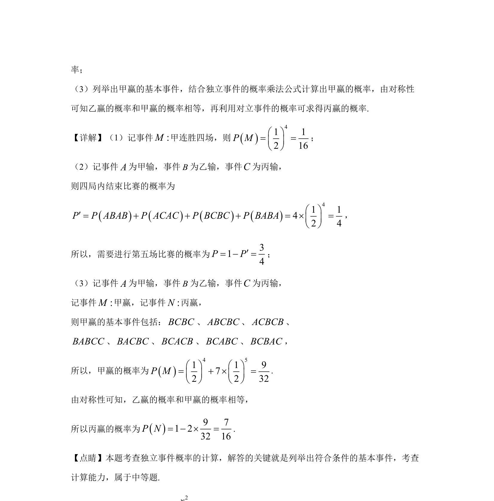

## 题面

## 摘要

本题考查独立事件概率计算，通过列举基本事件结合对立事件与对称性求概率。

## 关联考点

- [[独立事件概率乘法公式]]
- [[对立事件概率]]
- [[703-列举法|列举法]]
- [[834-对称性|对称性]]

## 答案与解析

> 📄 原 PDF 第 16 页：`素材/真题/湖南/2008-2024·（湖南）数学高考真题/2020年高考数学试卷（理）（新课标Ⅰ）（解析卷）.pdf`

<!-- 题干文本-start -->
## 题干文本
19.甲、乙、丙三位同学进行羽毛球比赛，约定赛制如下：累计负两场者被淘汰；比赛前抽签
决定首先比赛的两人，另一人轮空；每场比赛的胜者与轮空者进行下一场比赛，负者下一场
轮空，直至有一人被淘汰；当一人被淘汰后，剩余的两人继续比赛，直至其中一人被淘汰，
另一人最终获胜，比赛结束.经抽签，甲、乙首先比赛，丙轮空.设每场比赛双方获胜的概率
都为12，
（1）求甲连胜四场的概率；
（2）求需要进行第五场比赛的概率；
（3）求丙最终获胜的概率.
<!-- 题干文本-end -->

<!-- 解析文本-start -->
## 解析文本
【答案】（1）116
；（2）34
；（3）716
.
【解析】
【分析】
（1）根据独立事件的概率乘法公式可求得事件“甲连胜四场”的概率；
（2）计算出四局以内结束比赛的概率，然后利用对立事件的概率公式可求得所求事件的概
<!-- 解析文本-end -->
