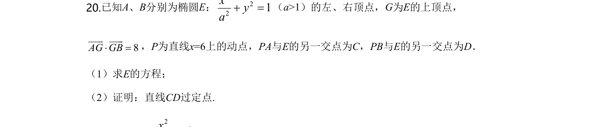
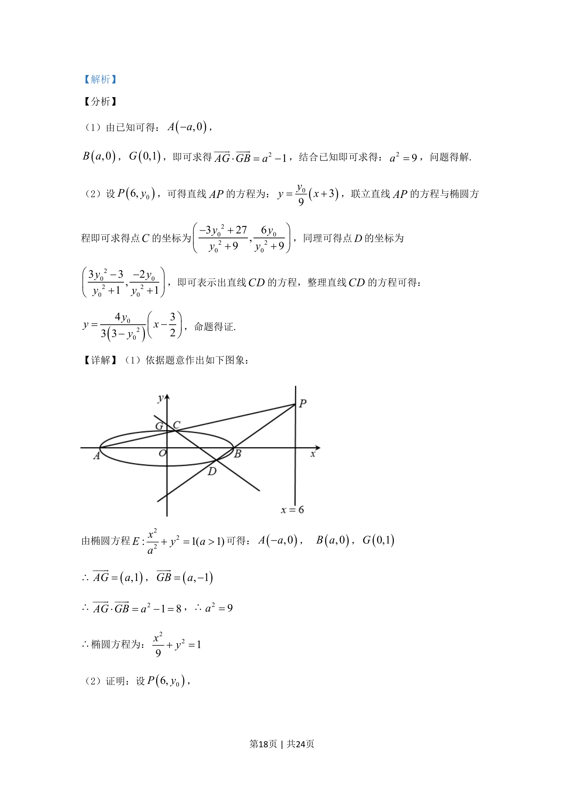
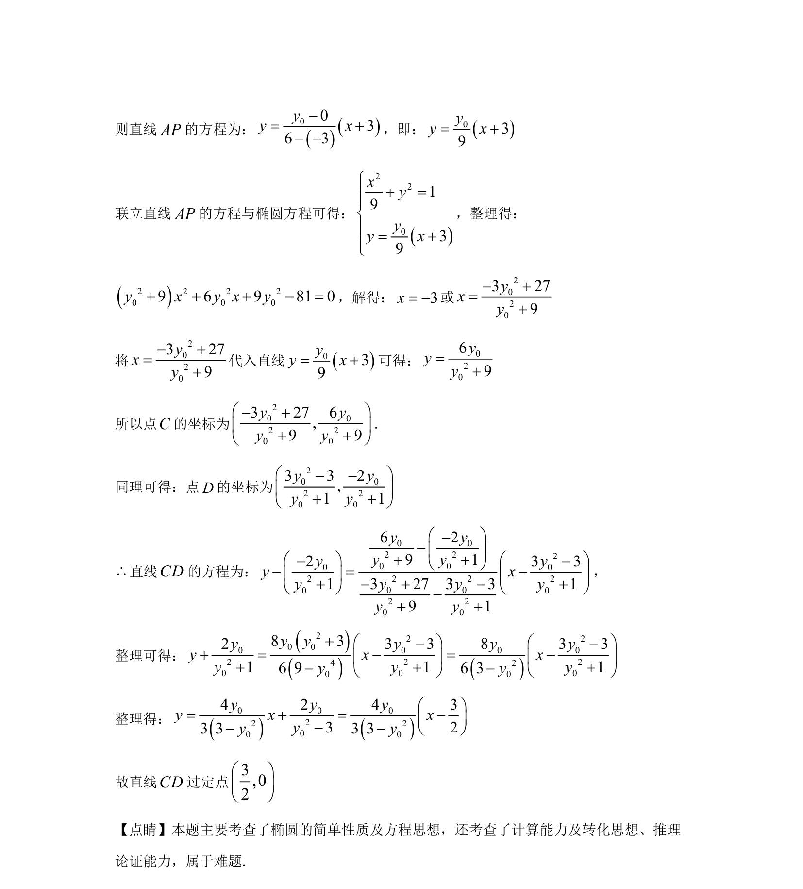

## 题面

## 摘要

椭圆方程与向量数量积结合求参数，设点联立求交点坐标并证明直线过定点。

## 关联考点

- [[941-椭圆标准方程|椭圆标准方程]]
- [[751-向量数量积|向量数量积]]
- [[1391-直线与椭圆位置关系|直线与椭圆位置关系]]
- [[377-定点定值问题|定点问题]]

## 答案与解析

> 📄 原 PDF 第 17 页：`素材/真题/湖南/2008-2024·（湖南）数学高考真题/2020年高考数学试卷（理）（新课标Ⅰ）（解析卷）.pdf`
