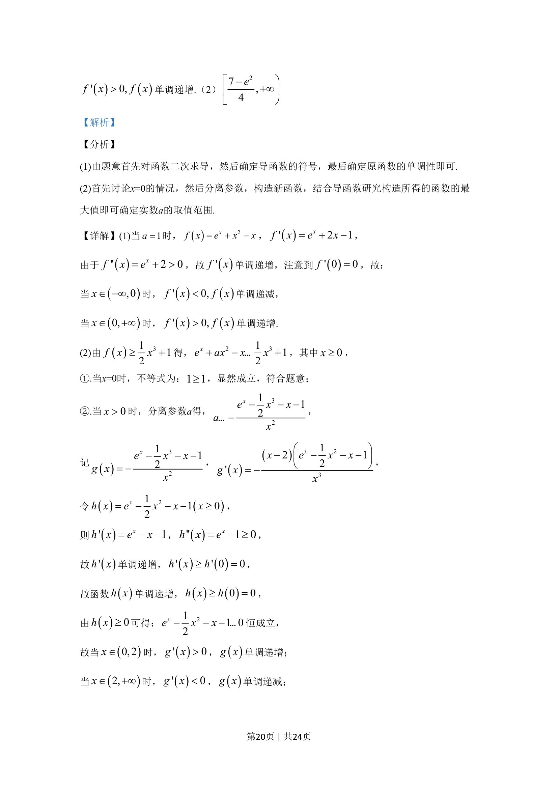
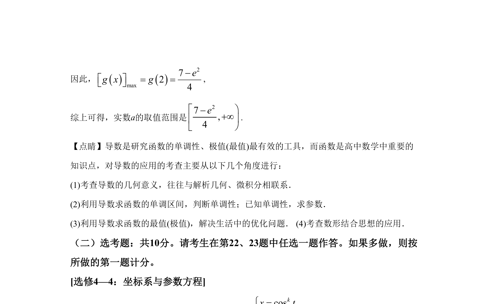

## 题面

## 摘要

本题主要考查利用导数研究函数单调性及含参不等式的恒成立问题，通过二次求导判断单调性并分离参数求最值。

## 关联考点

- [[705-利用导数研究函数的单调性|导数与单调性]]
- [[720-参数分离|参数分离]]
- [[419-函数最值-高中|函数最值]]
- [[531-不等式恒成立|不等式恒成立]]

## 答案与解析

> 📄 原 PDF 第 19 页：`素材/真题/湖南/2008-2024·（湖南）数学高考真题/2020年高考数学试卷（理）（新课标Ⅰ）（解析卷）.pdf`
