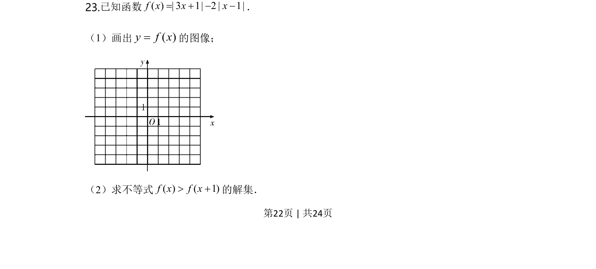
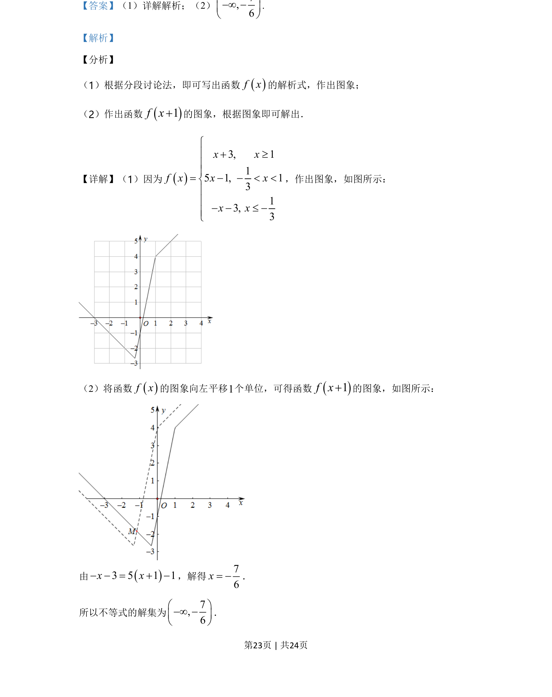
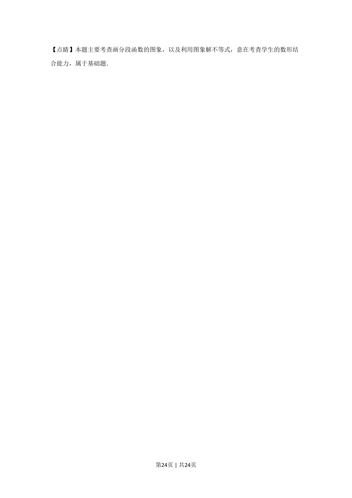

## 题面

## 摘要

分段函数解析式与图象，图象变换解不等式

## 关联考点

- [[290-分段函数|分段函数]]
- [[187-函数图象|函数图象]]
- [[283-函数的图象变换|图象平移]]
- [[897-数形结合|数形结合]]

## 答案与解析

> 📄 原 PDF 第 22 页：`素材/真题/湖南/2008-2024·（湖南）数学高考真题/2020年高考数学试卷（理）（新课标Ⅰ）（解析卷）.pdf`
