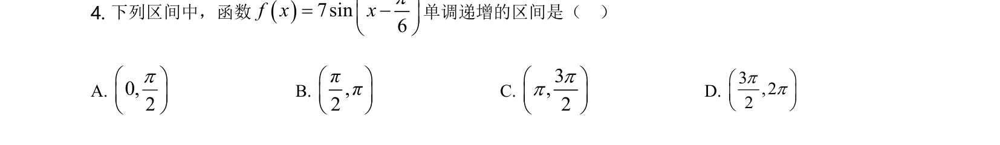
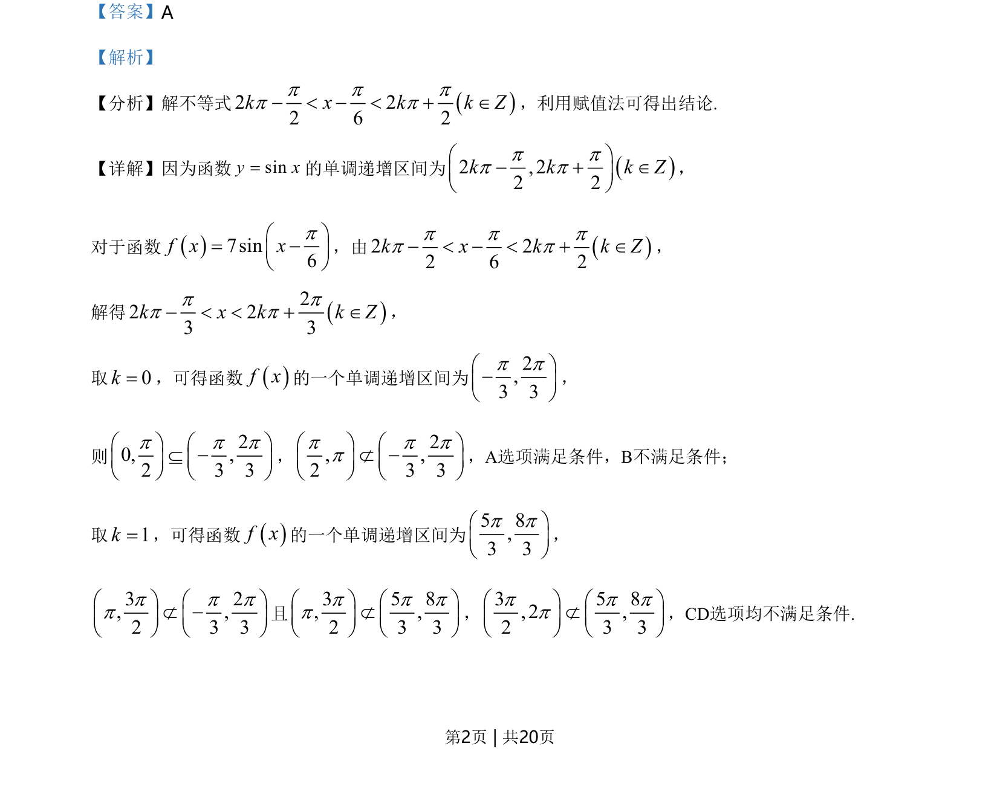
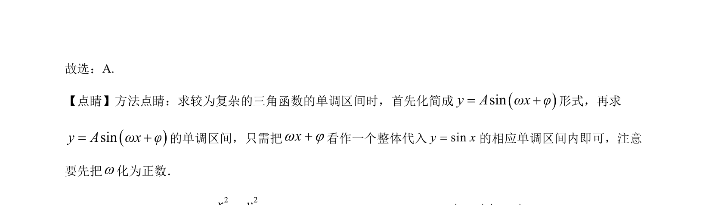

## 题面

## 摘要

考查利用正弦函数的单调递增区间求解具体函数的单调区间。

## 关联考点

- [[961-正弦函数的单调性|正弦函数的单调性]]
- [[1418-解三角不等式|解三角不等式]]

## 答案与解析

> 📄 原 PDF 第 2 页：`素材/真题/湖南/2008-2024·（湖南）数学高考真题/2021年高考数学试卷（新高考Ⅰ卷）（解析卷）.pdf`

<!-- 题干文本-start -->
## 题干文本
4. 下列区间中，函数()7sin6f xxpæ ö= -ç ÷è ø
单调递增的区间是（    ）
A. 0,2pæ öç ÷è ø
B. ,2ππæ öç ÷è ø
C. 3,2ppæ öç ÷è ø
D. 3,22ppæ öç ÷è ø
<!-- 题干文本-end -->

<!-- 解析文本-start -->
## 解析文本
【答案】A
【解析】
【分析】解不等式 ()2 22 6 2k x k k Zp p pp p- < - < + Î，利用赋值法可得出结论.
【详解】因为函数siny x=的单调递增区间为 ()22 , 22k k k Zp pp pæ ö- + Îç ÷è ø
，
对于函数()7sin6f xxpæ ö= -ç ÷è ø
，由 ()2 22 6 2k x k k Zp p pp p- < - < + Î，
解得 ()22 23 3k x k k Zp pp p- < < + Î，
取0k=，可得函数()f x的一个单调递增区间为2,3 3p pæ ö-ç ÷è ø
，
则
20, ,2 3 3p p pæ ö æ öÍ -ç ÷ ç ÷è ø è ø
，
2, ,2 3 3p p ppæ ö æ öË -ç ÷ ç ÷è ø è ø
，A选项满足条件，B不满足条件；
取1k=，可得函数()f x的一个单调递增区间为
5 8,3 3p pæ öç ÷è ø
，
3 2, ,2 3 3p p ppæ ö æ öË -ç ÷ ç ÷è ø è ø
且
3 5 8, ,2 3 3p p ppæ ö æ öËç ÷ ç ÷è ø è ø
，
3 5 8, 2 ,2 3 3p p ppæ ö æ öËç ÷ ç ÷è ø è ø
，CD选项均不满足条件.
<!-- 解析文本-end -->
