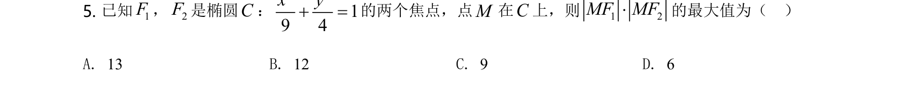
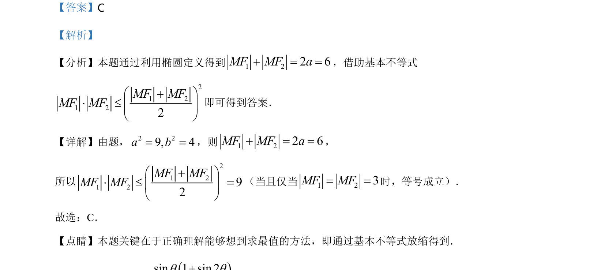

## 题面

## 摘要

利用椭圆定义得出两边和为定值，并用基本不等式求积的最大值。

## 关联考点

- [[1413-椭圆的定义|椭圆定义]]
- [[295-基本不等式|基本不等式]]
- [[286-函数的最值|最值]]

## 答案与解析

> 📄 原 PDF 第 3 页：`素材/真题/湖南/2008-2024·（湖南）数学高考真题/2021年高考数学试卷（新高考Ⅰ卷）（解析卷）.pdf`

<!-- 题干文本-start -->
## 题干文本
5. 已知1F，2F是椭圆C：
2 219 4x y+ =的两个焦点，点M在C上，则1 2MF MF×的最大值为（    ）
A. 13 B. 12 C. 9 D. 6
<!-- 题干文本-end -->

<!-- 解析文本-start -->
## 解析文本
【答案】C
【解析】
【分析】本题通过利用椭圆定义得到1226MFMFa+==，借助基本不等式
212122MFMFMFMFæ+ö×ç÷èø
即可得到答案．
【详解】由题，2 29, 4a b= =，则1226MFMFa+==，
所以
2121292MFMFMFMFæ+ö×=ç÷èø
（当且仅当123MFMF==时，等号成立）．
故选：C．
【点睛】本题关键在于正确理解能够想到求最值的方法，即通过基本不等式放缩得到．
<!-- 解析文本-end -->
