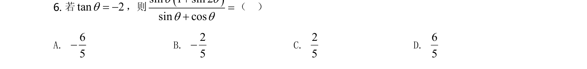
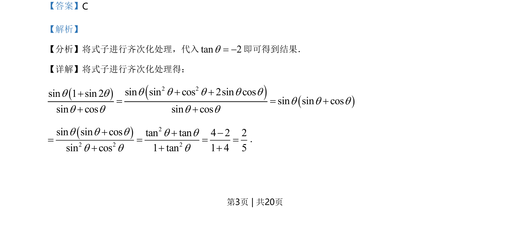
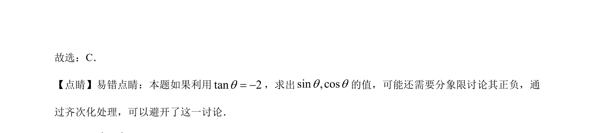

## 题面

## 摘要

齐次化处理三角式，利用tan值求正弦余弦分式值

## 关联考点

- [[272-三角恒等变换|三角恒等变换]]
- [[齐次化]]
- [[249-正切|正切]]
- [[610-三角函数求值|三角函数求值]]

## 答案与解析

> 📄 原 PDF 第 3 页：`素材/真题/湖南/2008-2024·（湖南）数学高考真题/2021年高考数学试卷（新高考Ⅰ卷）（解析卷）.pdf`
