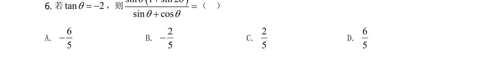
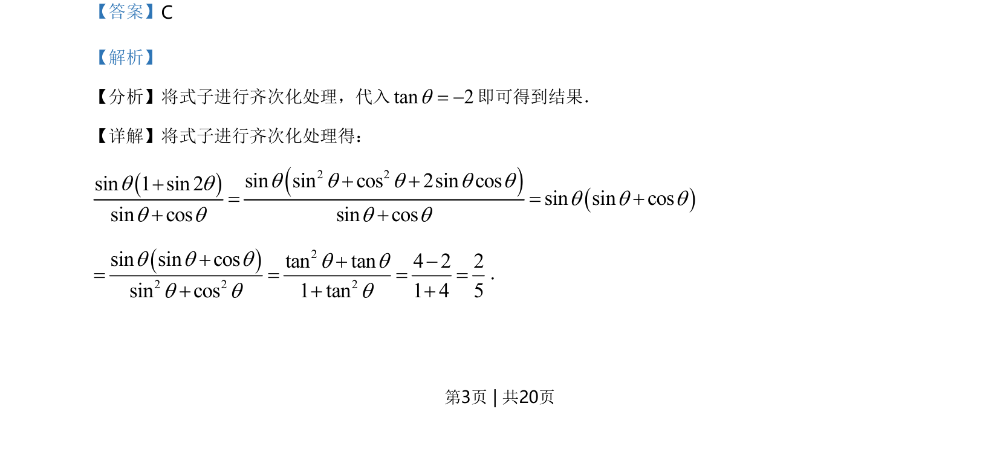
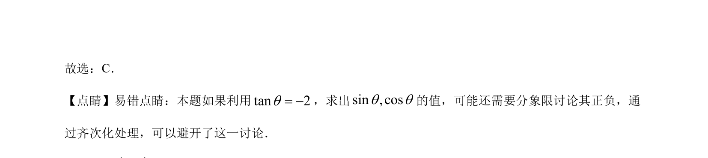

## 题面

## 摘要

齐次化处理三角式，利用tan值求正弦余弦分式值

## 关联考点

- [[272-三角恒等变换|三角恒等变换]]
- [[齐次化]]
- [[249-正切|正切]]
- [[610-三角函数求值|三角函数求值]]

## 答案与解析

> 📄 原 PDF 第 3 页：`素材/真题/湖南/2008-2024·（湖南）数学高考真题/2021年高考数学试卷（新高考Ⅰ卷）（解析卷）.pdf`

<!-- 题干文本-start -->
## 题干文本
6. 若tan 2q= -，则sin 1 sin 2sin cosq qq q+=+
（    ）
A. 65-B. 25-C. 25
D. 65
<!-- 题干文本-end -->

<!-- 解析文本-start -->
## 解析文本
【答案】C
【解析】
【分析】将式子进行齐次化处理，代入tan 2q= -即可得到结果．
【详解】将式子进行齐次化处理得：
22sinsincos2sincossin1sin2sinsincossincossincosqqqqqqqqqqqqqq+++==+++2222sinsincostantan422sincos1tan145qqqqqqqq++-====+++
．
<!-- 解析文本-end -->
