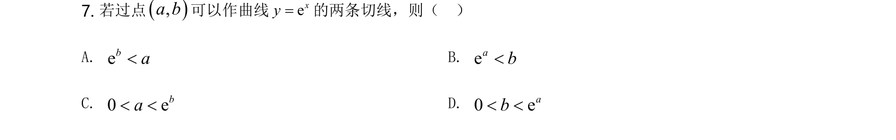
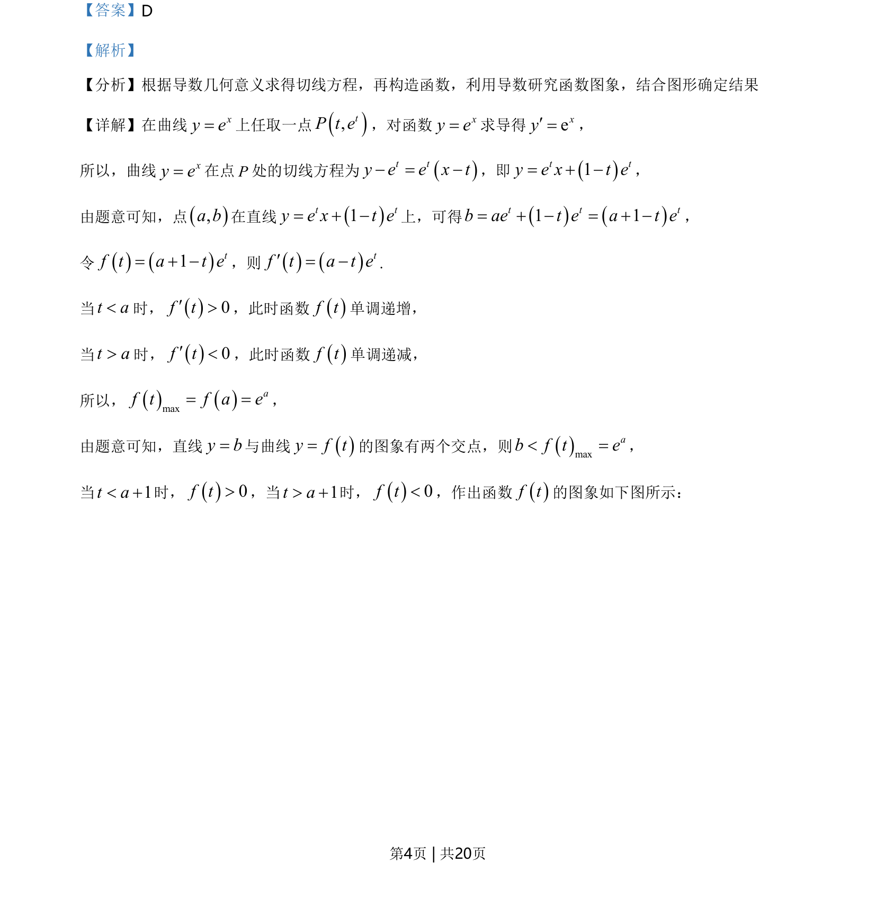
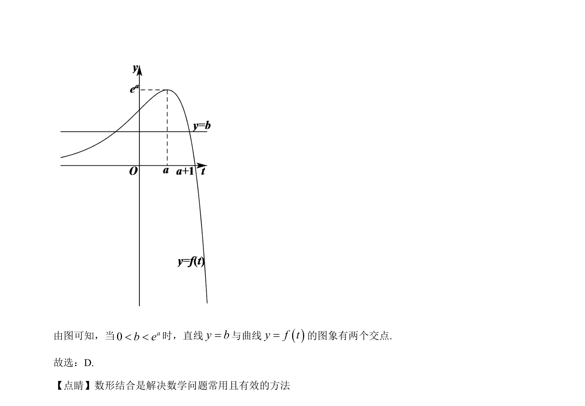

## 题面

## 摘要

通过导数几何意义求切线，构造函数并利用导数研究图象交点，确定参数范围

## 关联考点

- [[440-导数的几何意义|导数的几何意义]]
- [[利用导数研究函数图像]]
- [[1269-函数零点与方程根|函数零点与方程根]]
- [[897-数形结合|数形结合]]

## 答案与解析

> 📄 原 PDF 第 4 页：`素材/真题/湖南/2008-2024·（湖南）数学高考真题/2021年高考数学试卷（新高考Ⅰ卷）（解析卷）.pdf`
