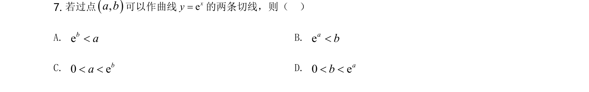
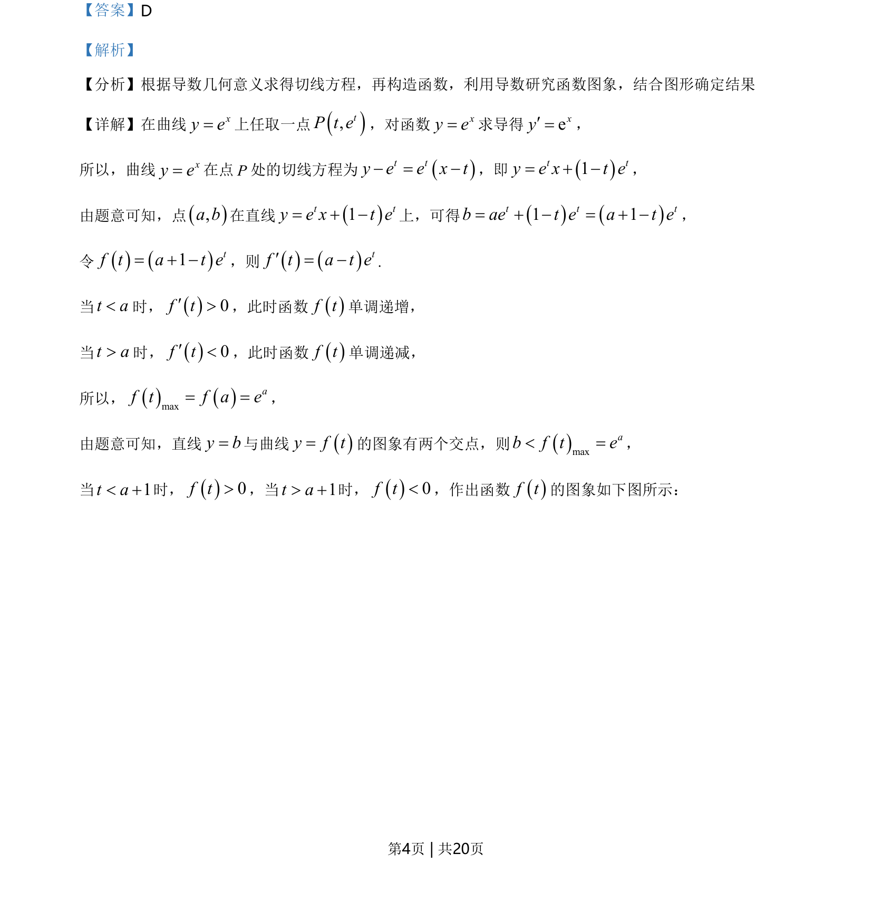
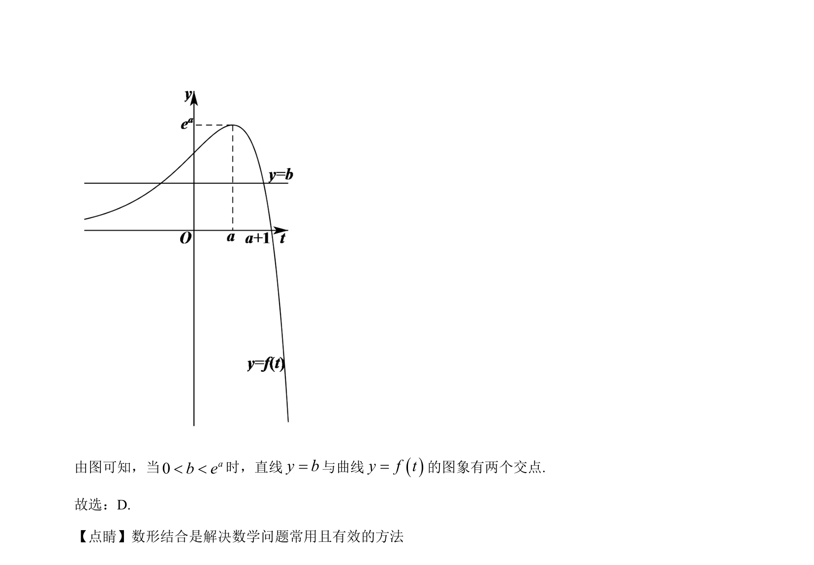

## 题面

## 摘要

通过导数几何意义求切线，构造函数并利用导数研究图象交点，确定参数范围

## 关联考点

- [[440-导数的几何意义|导数的几何意义]]
- [[利用导数研究函数图像]]
- [[1269-函数零点与方程根|函数零点与方程根]]
- [[897-数形结合|数形结合]]

## 答案与解析

> 📄 原 PDF 第 4 页：`素材/真题/湖南/2008-2024·（湖南）数学高考真题/2021年高考数学试卷（新高考Ⅰ卷）（解析卷）.pdf`

<!-- 题干文本-start -->
## 题干文本
7. 若过点,a b可以作曲线exy=的两条切线，则（    ）
A. eba< B. eab<
C. 0 eba< <D. 0 eab< <
<!-- 题干文本-end -->

<!-- 解析文本-start -->
## 解析文本
【答案】D
【解析】
【分析】根据导数几何意义求得切线方程，再构造函数，利用导数研究函数图象，结合图形确定结果
【详解】在曲线xy e=上任取一点,tP t e，对函数xy e=求导得exy¢=，
所以，曲线xy e=在点P处的切线方程为t ty e e x t- = -，即1t ty e x t e= + -，
由题意可知，点,a b在直线1t ty e x t e= + -上，可得1 1t t tb ae t e a t e= + - = + -，
令1tf t a t e= + -，则tf t a t e¢= -.
当t a<时，0f t¢>，此时函数f t单调递增，
当t a>时，0f t¢<，此时函数f t单调递减，
所以，maxaf t f a e= =，
由题意可知，直线y b=与曲线y f t=的图象有两个交点，则maxab f t e< =，
当1t a< +时，0f t>，当1t a> +时，0f t<，作出函数f t的图象如下图所示：
<!-- 解析文本-end -->
