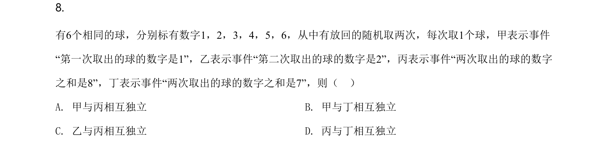
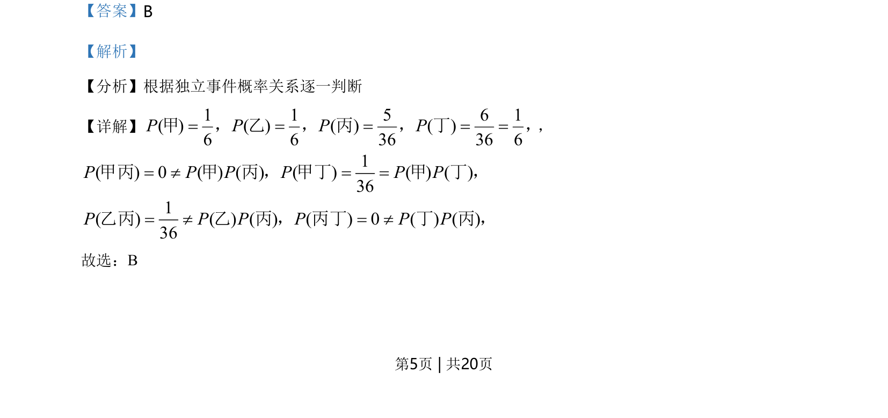
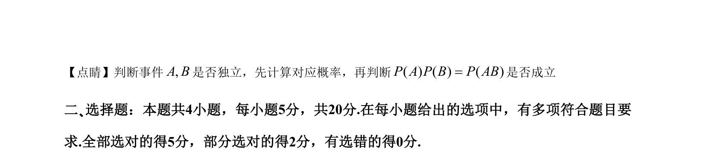

## 题面

## 摘要

考查独立事件概率的计算与判断，通过比较 P(A)P(B) 与 P(AB) 是否相等来确定事件独立性。

## 关联考点

- [[317-事件的关系运算|独立事件]]
- [[948-概率计算|概率计算]]

## 答案与解析

> 📄 原 PDF 第 5 页：`素材/真题/湖南/2008-2024·（湖南）数学高考真题/2021年高考数学试卷（新高考Ⅰ卷）（解析卷）.pdf`
