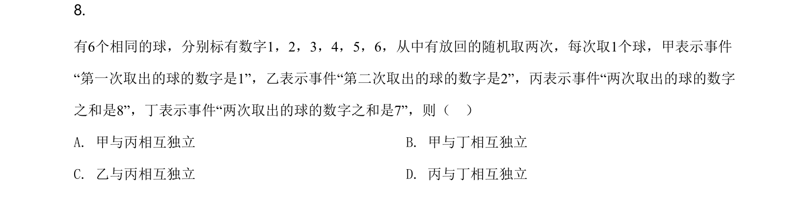
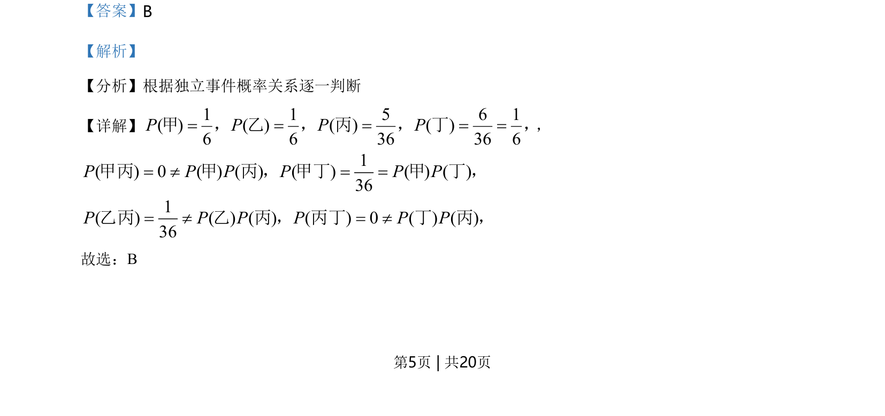
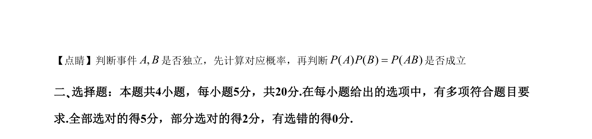

## 题面

## 摘要

考查独立事件概率的计算与判断，通过比较 P(A)P(B) 与 P(AB) 是否相等来确定事件独立性。

## 关联考点

- [[317-事件的关系运算|独立事件]]
- [[948-概率计算|概率计算]]

## 答案与解析

> 📄 原 PDF 第 5 页：`素材/真题/湖南/2008-2024·（湖南）数学高考真题/2021年高考数学试卷（新高考Ⅰ卷）（解析卷）.pdf`

<!-- 题干文本-start -->
## 题干文本
8. 
有6个相同的球，分别标有数字1，2，3，4，5，6，从中有放回的随机取两次，每次取1个球，甲表示事件
“第一次取出的球的数字是1”，乙表示事件“第二次取出的球的数字是2”，丙表示事件“两次取出的球的数字
之和是8”，丁表示事件“两次取出的球的数字之和是7”，则（    ）
A. 甲与丙相互独立B. 甲与丁相互独立
C. 乙与丙相互独立D. 丙与丁相互独立
<!-- 题干文本-end -->

<!-- 解析文本-start -->
## 解析文本
【答案】B
【解析】
【分析】根据独立事件概率关系逐一判断
【详解】1 1 5 6 1( ) ( ) ( ) ( )6 6 36 36 6P P P P= = = = =甲，乙，丙，丁， ，
1( ) 0 ( ) ( ) ( ) ( ) ( )36P P P P P P= ¹ = =甲丙甲丙，甲丁甲丁，1( ) ( ) ( ) ( ) 0 ( ) ( )36P P P P P P= ¹ = ¹乙丙乙丙，丙丁丁丙，
故选：B
<!-- 解析文本-end -->
