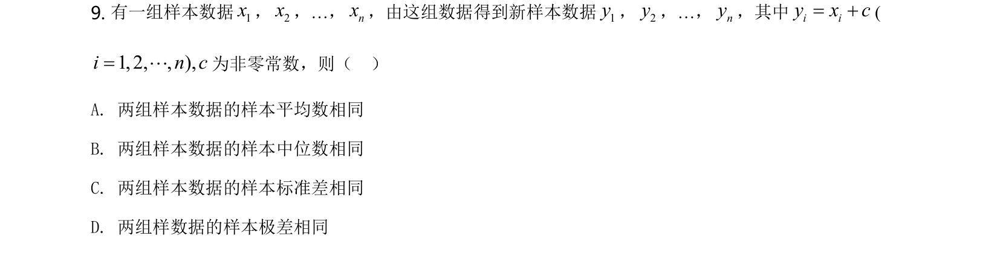
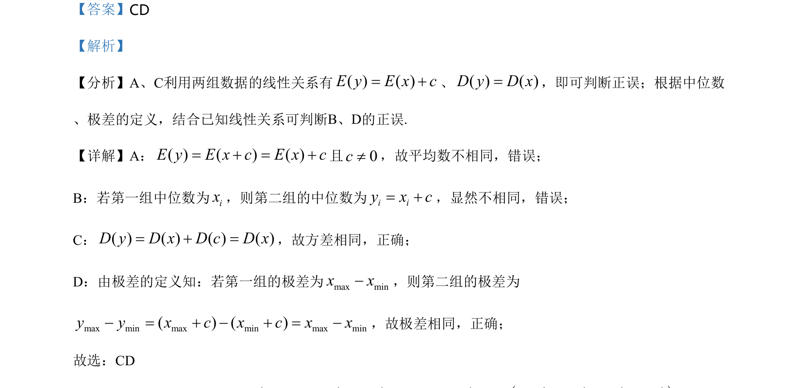

## 题面

## 摘要

考查两组数据线性变换后，平均数、中位数、方差与极差的变化规律。

## 关联考点

- [[期望与线性变换]]
- [[490-方差性质-高中|方差性质]]
- [[中位数变换]]
- [[极差变换]]

## 答案与解析

> 📄 原 PDF 第 6 页：`素材/真题/湖南/2008-2024·（湖南）数学高考真题/2021年高考数学试卷（新高考Ⅰ卷）（解析卷）.pdf`
