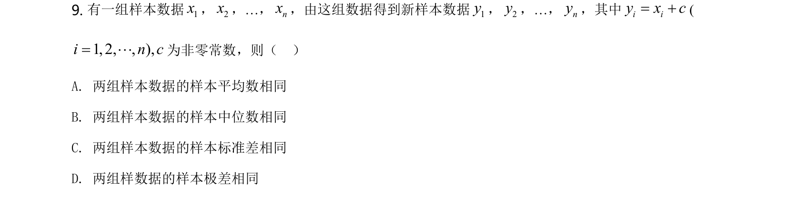
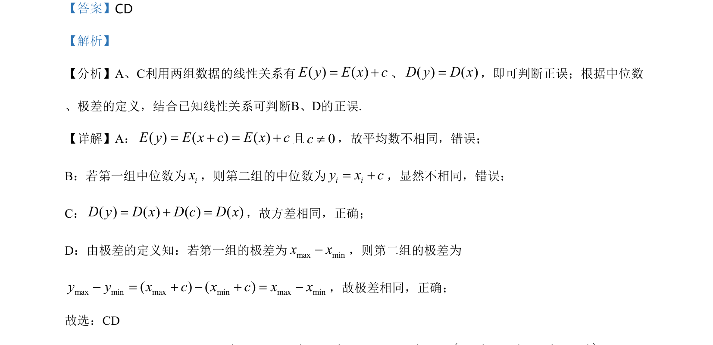

## 题面

## 摘要

考查两组数据线性变换后，平均数、中位数、方差与极差的变化规律。

## 关联考点

- [[期望与线性变换]]
- [[490-方差性质-高中|方差性质]]
- [[中位数变换]]
- [[极差变换]]

## 答案与解析

> 📄 原 PDF 第 6 页：`素材/真题/湖南/2008-2024·（湖南）数学高考真题/2021年高考数学试卷（新高考Ⅰ卷）（解析卷）.pdf`

<!-- 题干文本-start -->
## 题干文本
9. 有一组样本数据1x，2x，…，nx，由这组数据得到新样本数据1y，2y，…，ny，其中i iy x c= +(
1, 2, , ),i n c= ×××为非零常数，则（    ）
A. 两组样本数据的样本平均数相同
B. 两组样本数据的样本中位数相同
C. 两组样本数据的样本标准差相同
D. 两组样数据的样本极差相同
<!-- 题干文本-end -->

<!-- 解析文本-start -->
## 解析文本
【答案】CD
【解析】
【分析】A、C利用两组数据的线性关系有( ) ( )E y E x c= +、( ) ( )D y D x=，即可判断正误；根据中位数
、极差的定义，结合已知线性关系可判断B、D的正误.
【详解】A：( ) ( ) ( )E y E x c E x c= + = +且0c¹，故平均数不相同，错误；
B：若第一组中位数为ix，则第二组的中位数为i iy x c= +，显然不相同，错误；
C：( ) ( ) ( ) ( )D y D x D c D x= + =，故方差相同，正确；
D：由极差的定义知：若第一组的极差为max minx x-，则第二组的极差为
max min max min max min( ) ( )y y x c x c x x- = + - + = -，故极差相同，正确；
故选：CD
<!-- 解析文本-end -->
