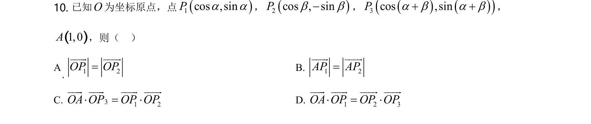
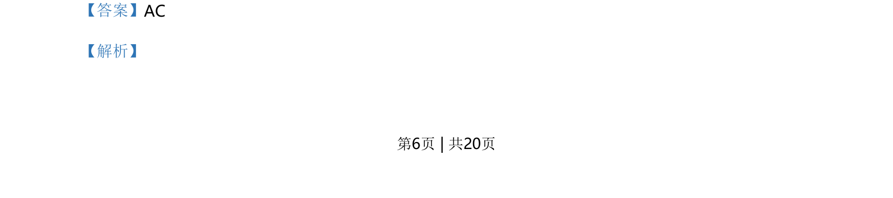
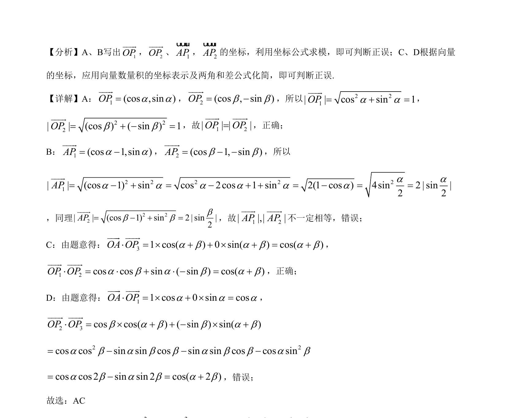

## 题面

## 摘要

本题考查向量坐标表示、模的计算及数量积的坐标运算，并结合三角恒等变换判断命题正误。

## 关联考点

- [[541-向量坐标运算|向量坐标运算]]
- [[752-向量模长|向量的模]]
- [[328-向量的数量积|数量积]]
- [[274-两角和差正余弦|两角和差公式]]

## 答案与解析

> 📄 原 PDF 第 6 页：`素材/真题/湖南/2008-2024·（湖南）数学高考真题/2021年高考数学试卷（新高考Ⅰ卷）（解析卷）.pdf`
