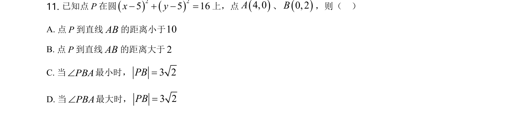
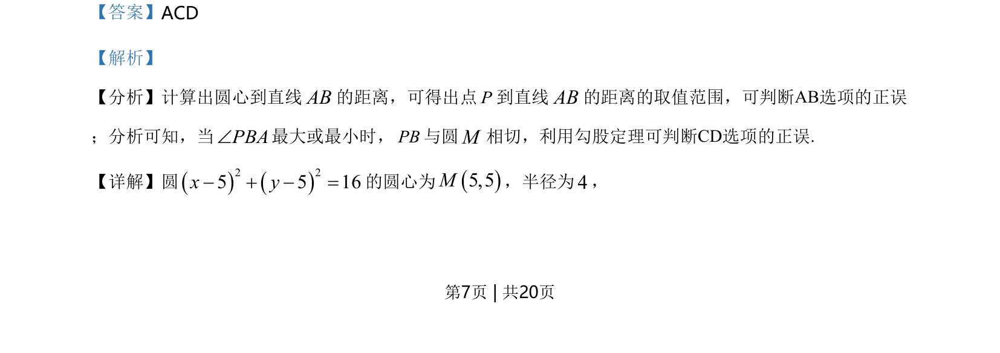
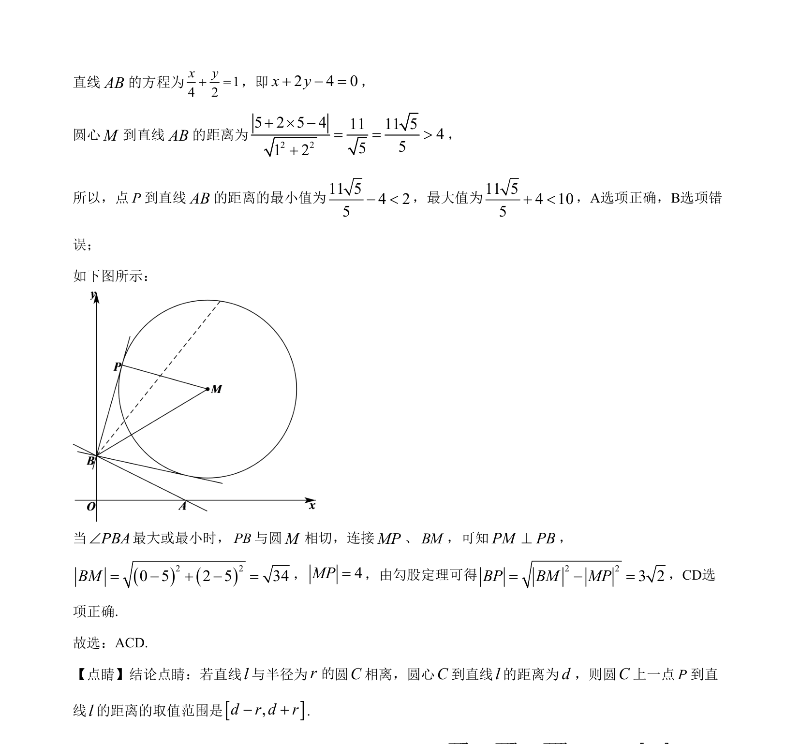

## 题面

## 摘要

考查圆与直线的位置关系及点到直线距离的最值，结合切线性质求角度最值。

## 关联考点

- [[373-圆的标准方程|圆的标准方程]]
- [[980-点到直线的距离|点到直线的距离]]
- [[直线与圆相离]]
- [[702-切线性质|切线性质]]
- [[189-勾股定理|勾股定理]]

## 答案与解析

> 📄 原 PDF 第 7 页：`素材/真题/湖南/2008-2024·（湖南）数学高考真题/2021年高考数学试卷（新高考Ⅰ卷）（解析卷）.pdf`
