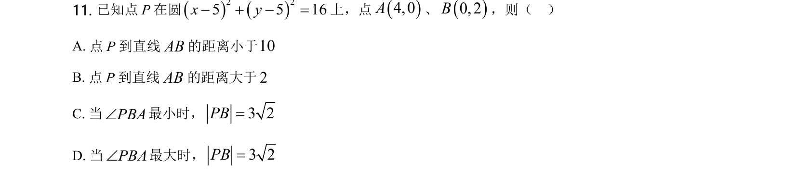
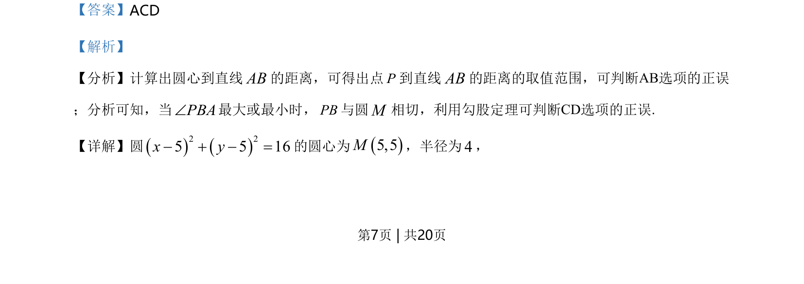
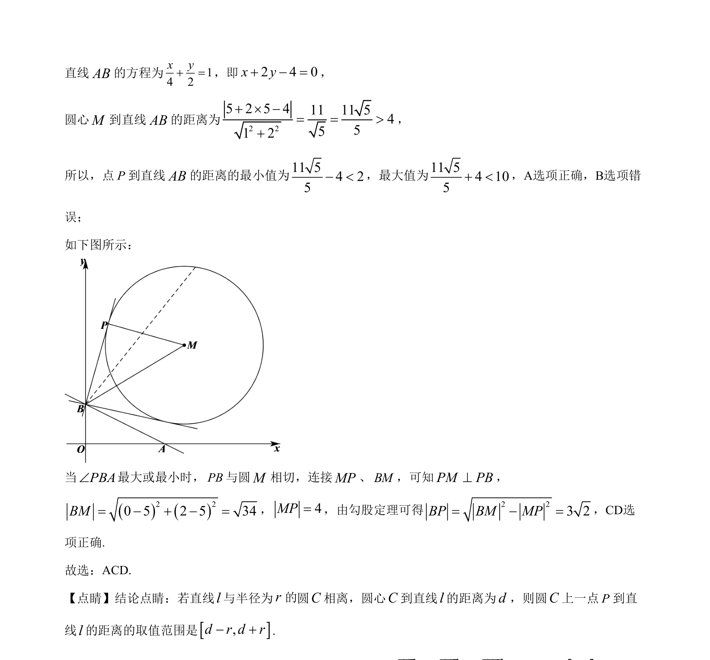

## 题面

## 摘要

考查圆与直线的位置关系及点到直线距离的最值，结合切线性质求角度最值。

## 关联考点

- [[373-圆的标准方程|圆的标准方程]]
- [[1211-点到直线距离|点到直线的距离]]
- [[直线与圆相离]]
- [[702-切线性质|切线性质]]
- [[189-勾股定理|勾股定理]]

## 答案与解析

> 📄 原 PDF 第 7 页：`素材/真题/湖南/2008-2024·（湖南）数学高考真题/2021年高考数学试卷（新高考Ⅰ卷）（解析卷）.pdf`

<!-- 题干文本-start -->
## 题干文本
11. 已知点P在圆()()2 25 5 16x y- + - =上，点()4,0A、()0, 2B，则（    ）
A. 点P到直线AB的距离小于10
B. 点P到直线AB的距离大于2
C. 当PBAÐ最小时，3 2PB=
D. 当PBAÐ最大时，3 2PB=
<!-- 题干文本-end -->

<!-- 解析文本-start -->
## 解析文本
【答案】ACD
【解析】
【分析】计算出圆心到直线AB的距离，可得出点P到直线AB的距离的取值范围，可判断AB选项的正误
；分析可知，当PBAÐ最大或最小时，PB与圆M相切，利用勾股定理可判断CD选项的正误.
【详解】圆()()2 25 5 16x y- + - =的圆心为()5,5M，半径为4，
<!-- 解析文本-end -->
