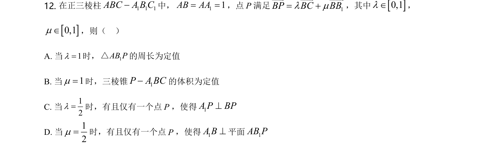
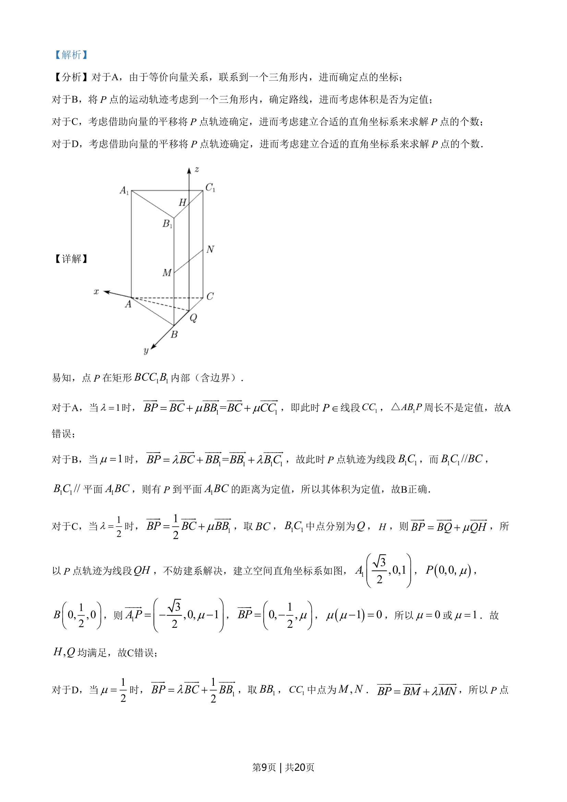
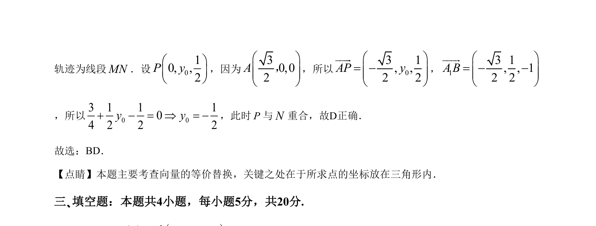

## 题面

## 摘要

考查空间动点轨迹与体积定值问题，借助向量平移确定轨迹并求解点的个数。

## 关联考点

- [[401-空间向量基本概念|空间向量]]
- [[715-动点轨迹|动点轨迹]]
- [[体积定值]]
- [[787-坐标法|坐标法]]

## 答案与解析

> 📄 原 PDF 第 8 页：`素材/真题/湖南/2008-2024·（湖南）数学高考真题/2021年高考数学试卷（新高考Ⅰ卷）（解析卷）.pdf`
