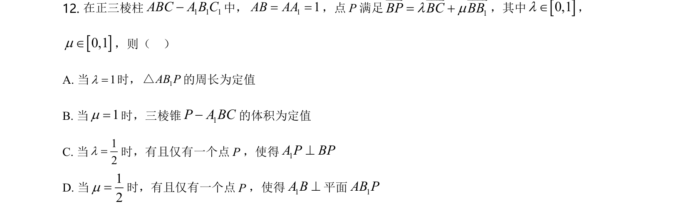
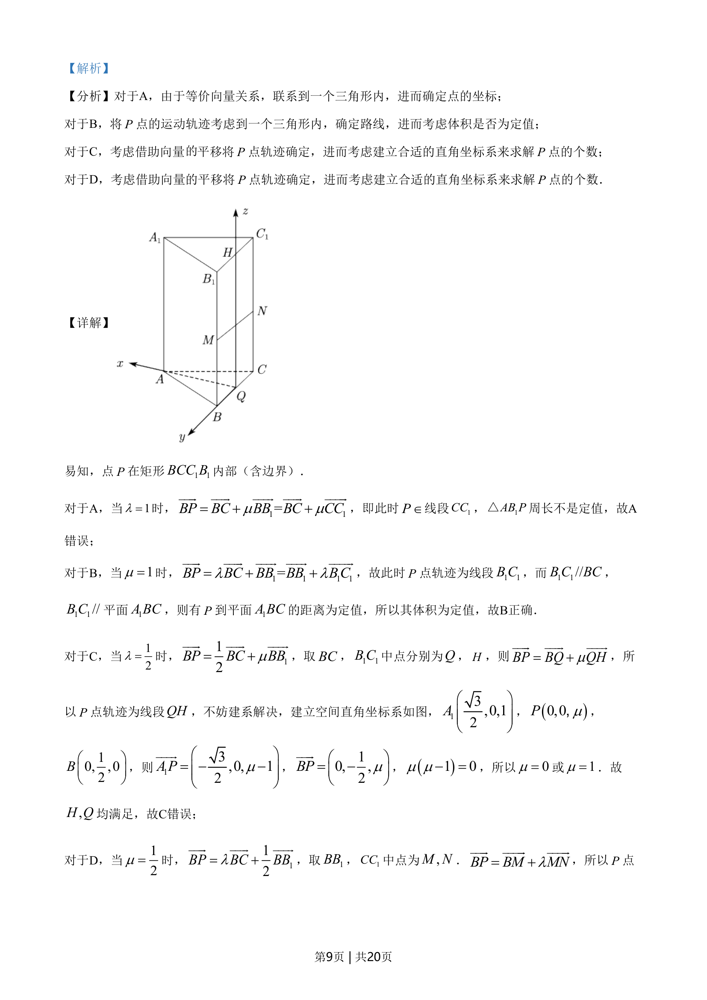
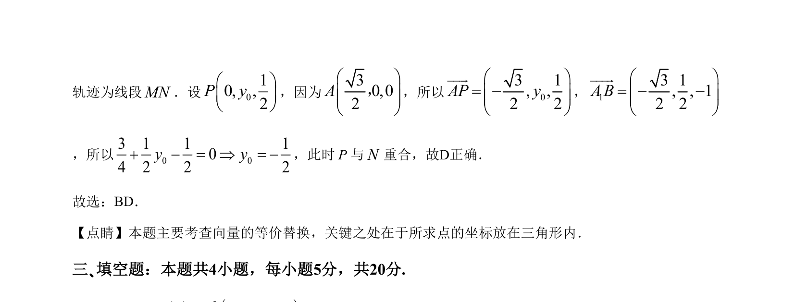

## 题面

## 摘要

考查空间动点轨迹与体积定值问题，借助向量平移确定轨迹并求解点的个数。

## 关联考点

- [[401-空间向量基本概念|空间向量]]
- [[715-动点轨迹|动点轨迹]]
- [[体积定值]]
- [[787-坐标法|坐标法]]

## 答案与解析

> 📄 原 PDF 第 8 页：`素材/真题/湖南/2008-2024·（湖南）数学高考真题/2021年高考数学试卷（新高考Ⅰ卷）（解析卷）.pdf`

<!-- 题干文本-start -->
## 题干文本
12. 在正三棱柱 1 1 1ABC A B C-中， 11AB AA= =，点P满足 1BP BC BBl m= +uuu r uuu r uuur
，其中[]0,1lÎ，
[]0,1mÎ，则（    ）
A. 当1l=时，1AB P△的周长为定值
B. 当1m=时，三棱锥1P A BC-的体积为定值
C. 当12l=时，有且仅有一个点P，使得1A P BP^
D. 当12m=时，有且仅有一个点P，使得1AB^平面1ABP
<!-- 题干文本-end -->

<!-- 解析文本-start -->
## 解析文本
【答案】BD
的
<!-- 解析文本-end -->
