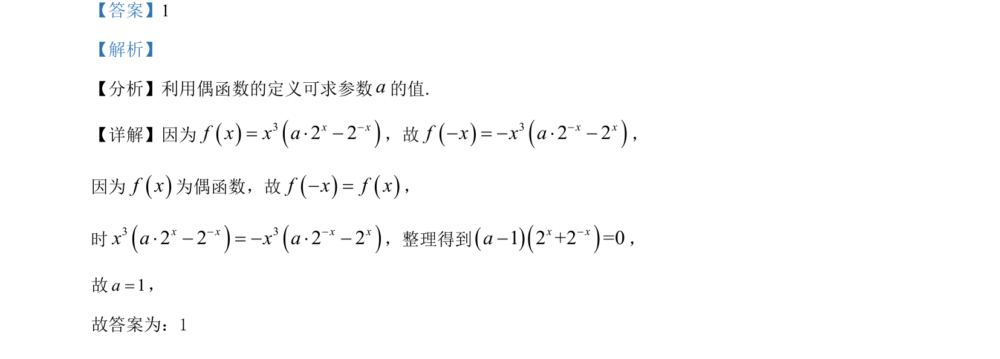

## 题面

## 摘要

利用偶函数定义建立方程，求解参数的值。

## 关联考点

- [[284-函数的奇偶性|函数的奇偶性]]
- [[284-函数的奇偶性|偶函数]]
- [[1079-系数求解|待定系数法]]

## 答案与解析

> 📄 原 PDF 第 10 页：`素材/真题/湖南/2008-2024·（湖南）数学高考真题/2021年高考数学试卷（新高考Ⅰ卷）（解析卷）.pdf`
