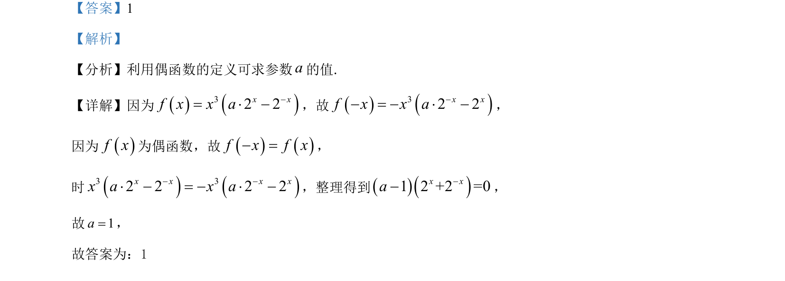

## 题面

## 摘要

利用偶函数定义建立方程，求解参数的值。

## 关联考点

- [[284-函数的奇偶性|函数的奇偶性]]
- [[284-函数的奇偶性|偶函数]]
- [[1079-系数求解|待定系数法]]

## 答案与解析

> 📄 原 PDF 第 10 页：`素材/真题/湖南/2008-2024·（湖南）数学高考真题/2021年高考数学试卷（新高考Ⅰ卷）（解析卷）.pdf`

<!-- 题干文本-start -->
## 题干文本
13. 已知函数()()32 2x xx af x-= × -是偶函数，则a=______.
<!-- 题干文本-end -->

<!-- 解析文本-start -->
## 解析文本
【答案】1
【解析】
【分析】利用偶函数的定义可求参数a的值.
【详解】因为()()32 2x xx af x-= × -，故()()32 2x xf x x a-- = - × -，
因为()f x为偶函数，故()()f x f x- =，
时()()3 32 2 2 2x x x xx a x a- -× - = - × -，整理得到()()1 2 +2 =0x xa--，
故1a=，
故答案为：1
<!-- 解析文本-end -->
