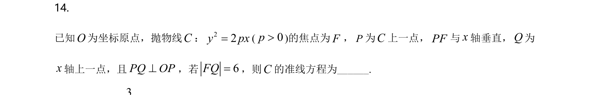
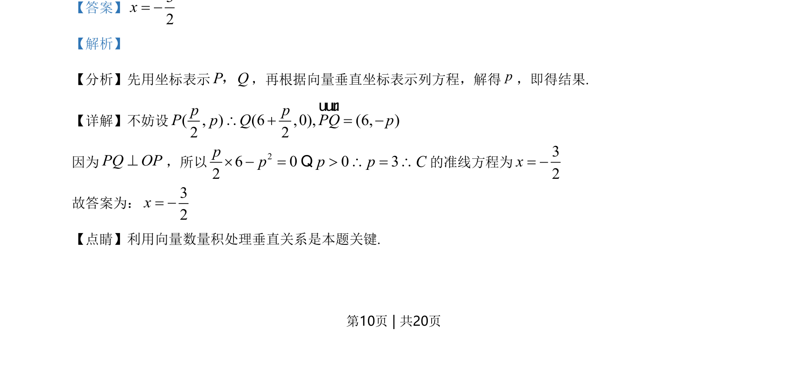

## 题面

## 摘要

通过抛物线定义和向量垂直条件求准线方程。

## 关联考点

- [[227-抛物线|抛物线]]
- [[542-向量垂直|向量垂直]]
- [[准线方程]]
- [[788-坐标运算|坐标运算]]

## 答案与解析

> 📄 原 PDF 第 10 页：`素材/真题/湖南/2008-2024·（湖南）数学高考真题/2021年高考数学试卷（新高考Ⅰ卷）（解析卷）.pdf`
