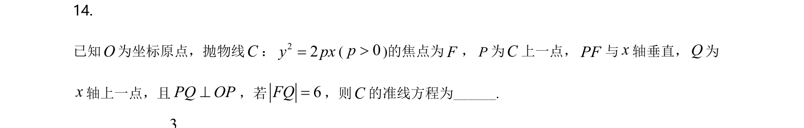
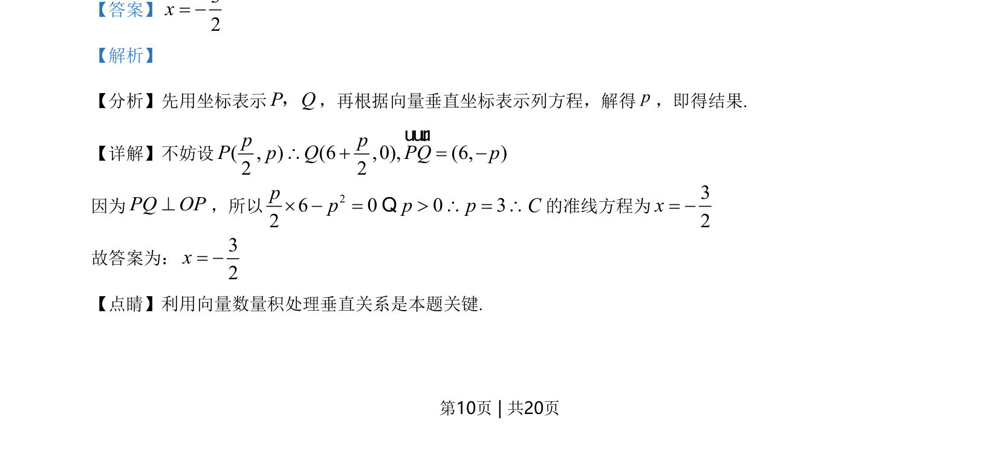

## 题面

## 摘要

通过抛物线定义和向量垂直条件求准线方程。

## 关联考点

- [[227-抛物线|抛物线]]
- [[542-向量垂直|向量垂直]]
- [[准线方程]]
- [[788-坐标运算|坐标运算]]

## 答案与解析

> 📄 原 PDF 第 10 页：`素材/真题/湖南/2008-2024·（湖南）数学高考真题/2021年高考数学试卷（新高考Ⅰ卷）（解析卷）.pdf`

<!-- 题干文本-start -->
## 题干文本
14. 
已知O为坐标原点，抛物线C：22y px=(0p>)的焦点为F，P为C上一点，PF与x轴垂直，Q为
x轴上一点，且PQ OP^，若6FQ=，则C的准线方程为______.
<!-- 题干文本-end -->

<!-- 解析文本-start -->
## 解析文本
【答案】32x= -
【解析】
【分析】先用坐标表示P Q，，再根据向量垂直坐标表示列方程，解得p，即得结果.
【详解】不妨设( , ) (6 ,0), (6, )2 2p pP p Q PQ p\ + = -u u u r
因为PQ OP^，所以 26 0 0 32pp p p´ - = > \ = \QC的准线方程为32x= -
故答案为：32x= -
【点睛】利用向量数量积处理垂直关系是本题关键.
<!-- 解析文本-end -->
