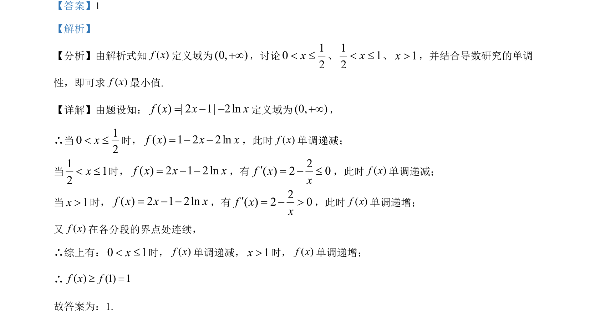

## 题面

## 摘要

分段函数含绝对值和对数，通过分类讨论并利用导数求最值。

## 关联考点

- [[290-分段函数|分段函数]]
- [[705-利用导数研究函数的单调性|导数与单调性]]
- [[419-函数最值-高中|函数最值]]

## 答案与解析

> 📄 原 PDF 第 11 页：`素材/真题/湖南/2008-2024·（湖南）数学高考真题/2021年高考数学试卷（新高考Ⅰ卷）（解析卷）.pdf`
