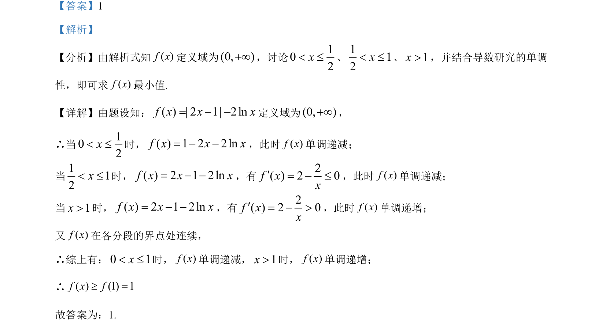

## 题面

## 摘要

分段函数含绝对值和对数，通过分类讨论并利用导数求最值。

## 关联考点

- [[290-分段函数|分段函数]]
- [[705-利用导数研究函数的单调性|导数与单调性]]
- [[419-函数最值-高中|函数最值]]

## 答案与解析

> 📄 原 PDF 第 11 页：`素材/真题/湖南/2008-2024·（湖南）数学高考真题/2021年高考数学试卷（新高考Ⅰ卷）（解析卷）.pdf`

<!-- 题干文本-start -->
## 题干文本
15. 函数2 1 2lnf x x x= - -的最小值为______.
<!-- 题干文本-end -->

<!-- 解析文本-start -->
## 解析文本
【答案】1
【解析】
【分析】由解析式知( )f x定义域为(0, )+¥，讨论102x< 、112x< 、1x>，并结合导数研究的单调
性，即可求( )f x最小值.
【详解】由题设知：( ) | 2 1| 2lnf x x x= - -定义域为(0, )+¥，
∴当102x< 时，( ) 1 2 2lnf x x x= - -，此时( )f x单调递减；
当112x< 时，( ) 2 1 2lnf x x x= - -，有 2( ) 2 0f xx¢= - ，此时( )f x单调递减；
当1x>时，( ) 2 1 2lnf x x x= - -，有 2( ) 2 0f xx¢= - >，此时( )f x单调递增；
又( )f x在各分段的界点处连续，
∴综上有：0 1x< 时，( )f x单调递减，1x>时，( )f x单调递增；
∴()(1)1fxf=
故答案为：1.
<!-- 解析文本-end -->
