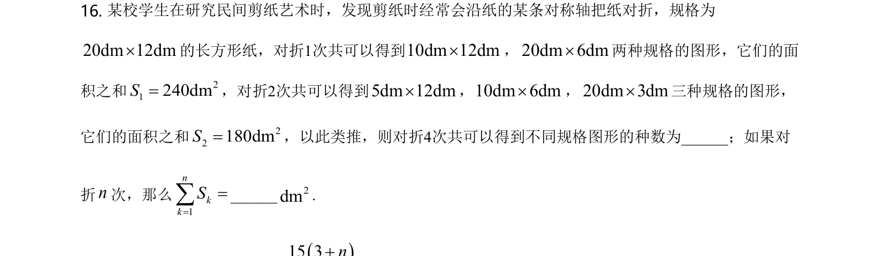
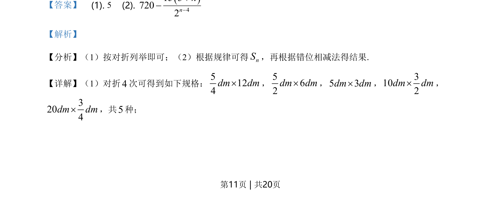
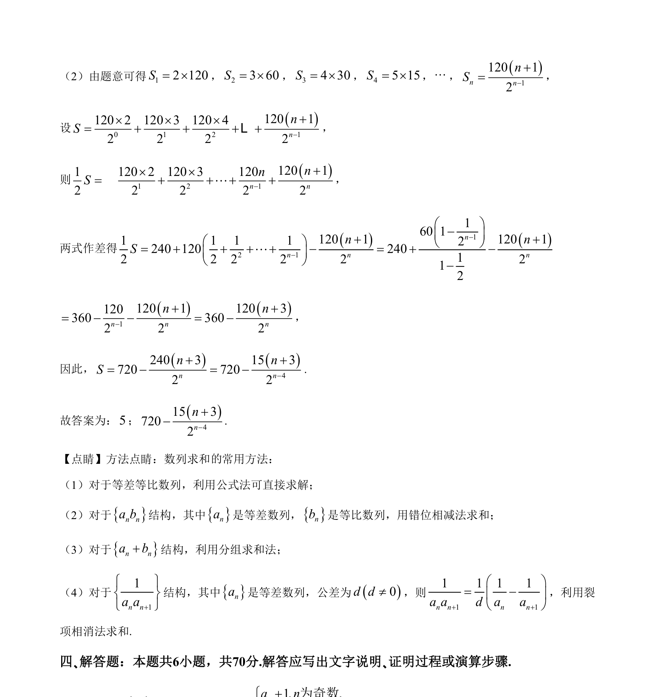

## 题面

## 摘要

此题考查通过折叠问题归纳数列规律并利用错位相减法求数列的前n项和。

## 关联考点

- [[1081-累加求和|数列求和]]
- [[385-数列错位相减|错位相减法]]

## 答案与解析

> 📄 原 PDF 第 11 页：`素材/真题/湖南/2008-2024·（湖南）数学高考真题/2021年高考数学试卷（新高考Ⅰ卷）（解析卷）.pdf`

<!-- 题干文本-start -->
## 题干文本
16. 某校学生在研究民间剪纸艺术时，发现剪纸时经常会沿纸的某条对称轴把纸对折，规格为
20dm 12dm´的长方形纸，对折1次共可以得到10dm 12dm´，20dm 6dm´两种规格的图形，它们的面
积之和 21240dmS=，对折2次共可以得到5dm 12dm´，10dm 6dm´，20dm 3dm´三种规格的图形，
它们的面积之和 22180dmS=，以此类推，则对折4次共可以得到不同规格图形的种数为______；如果对
折n次，那么
1nkkS==å______2dm.
<!-- 题干文本-end -->

<!-- 解析文本-start -->
## 解析文本
【答案】    (1). 5    (2). 415 37202nn-+-
【解析】
【分析】（1）按对折列举即可；（2）根据规律可得nS，再根据错位相减法得结果.
【详解】（1）对折4次可得到如下规格：5124dm dm´，562dm dm´，5 3dm dm´，3102dm dm´，
3204dm dm´，共5种；
<!-- 解析文本-end -->
