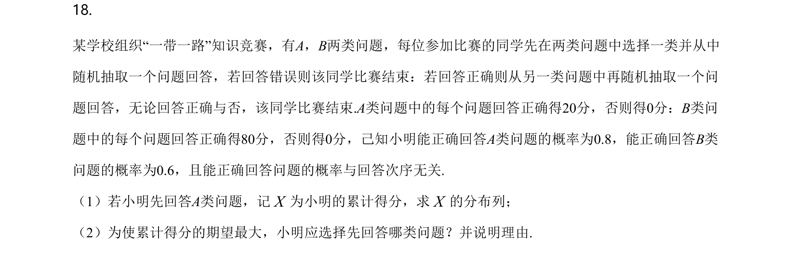
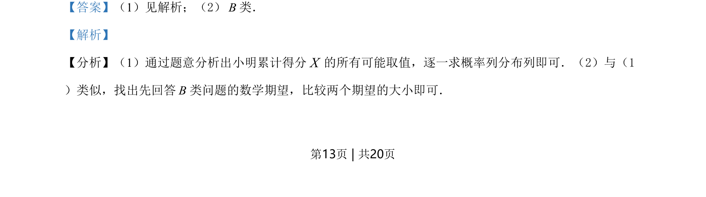
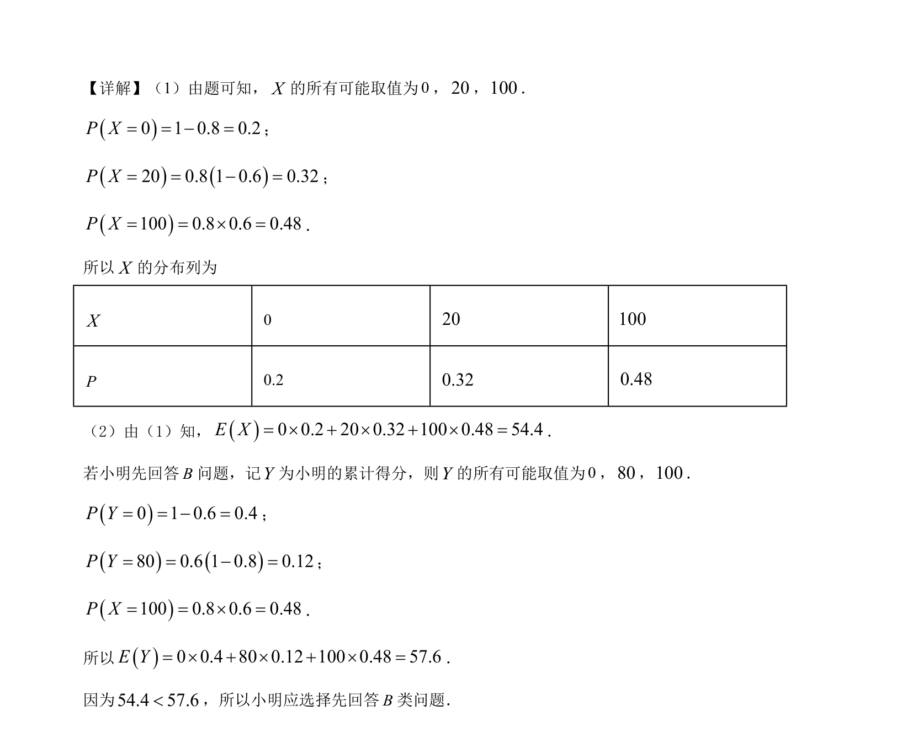

## 题面

## 摘要

考查离散型随机变量的分布列与数学期望，并通过比较期望值进行决策。

## 关联考点

- [[1330-离散型随机变量及其分布列|离散型随机变量及其分布列]]
- [[1039-离散型随机变量的期望|数学期望]]
- [[决策问题]]

## 答案与解析

> 📄 原 PDF 第 13 页：`素材/真题/湖南/2008-2024·（湖南）数学高考真题/2021年高考数学试卷（新高考Ⅰ卷）（解析卷）.pdf`
