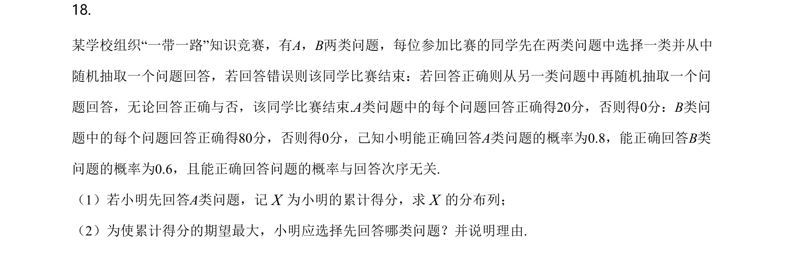
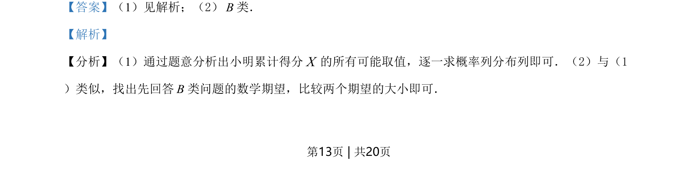
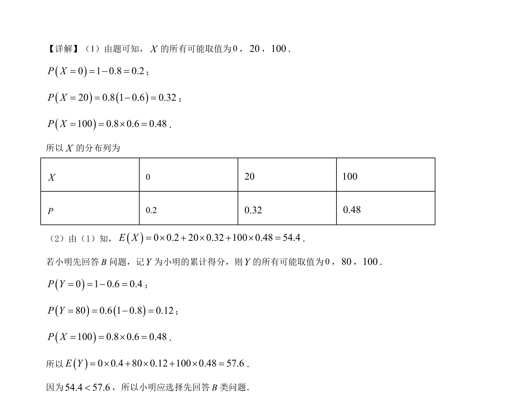

## 题面

## 摘要

考查离散型随机变量的分布列与数学期望，并通过比较期望值进行决策。

## 关联考点

- [[1330-离散型随机变量及其分布列|离散型随机变量及其分布列]]
- [[501-离散型随机变量期望|数学期望]]
- [[决策问题]]

## 答案与解析

> 📄 原 PDF 第 13 页：`素材/真题/湖南/2008-2024·（湖南）数学高考真题/2021年高考数学试卷（新高考Ⅰ卷）（解析卷）.pdf`

<!-- 题干文本-start -->
## 题干文本
18. 
某学校组织“一带一路”知识竞赛，有A，B两类问题，每位参加比赛的同学先在两类问题中选择一类并从中
随机抽取一个问题回答，若回答错误则该同学比赛结束：若回答正确则从另一类问题中再随机抽取一个问
题回答，无论回答正确与否，该同学比赛结束.A类问题中的每个问题回答正确得20分，否则得0分：B类问
题中的每个问题回答正确得80分，否则得0分，己知小明能正确回答A类问题的概率为0.8，能正确回答B类
问题的概率为0.6，且能正确回答问题的概率与回答次序无关.
（1）若小明先回答A类问题，记X为小明的累计得分，求X的分布列；
（2）为使累计得分的期望最大，小明应选择先回答哪类问题？并说明理由.
<!-- 题干文本-end -->

<!-- 解析文本-start -->
## 解析文本
【答案】（1）见解析；（2）B类．
【解析】
【分析】（1）通过题意分析出小明累计得分X的所有可能取值，逐一求概率列分布列即可．（2）与（1
）类似，找出先回答B类问题的数学期望，比较两个期望的大小即可．
<!-- 解析文本-end -->
