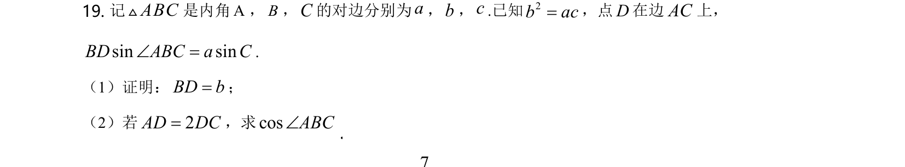
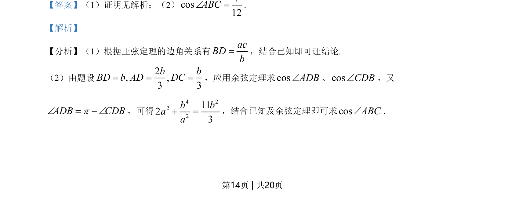
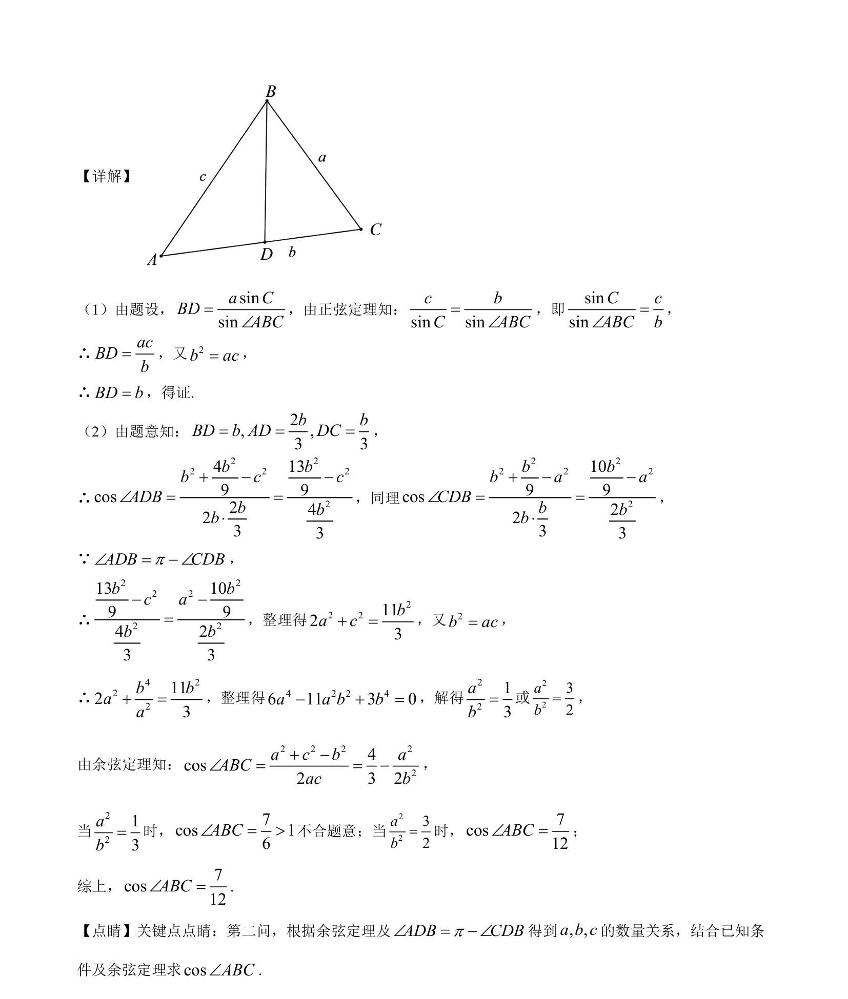

## 题面

## 摘要

该题考查利用正弦定理和余弦定理证明线段关系，并结合边长比例及代数变换求角的余弦值。

## 关联考点

- [[126-定理|正弦定理]]
- [[126-定理|余弦定理]]
- [[1368-代数化简|代数化简]]
- [[589-解三角形|解三角形]]

## 答案与解析

> 📄 原 PDF 第 14 页：`素材/真题/湖南/2008-2024·（湖南）数学高考真题/2021年高考数学试卷（新高考Ⅰ卷）（解析卷）.pdf`
