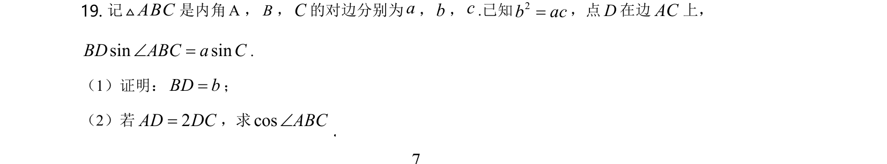
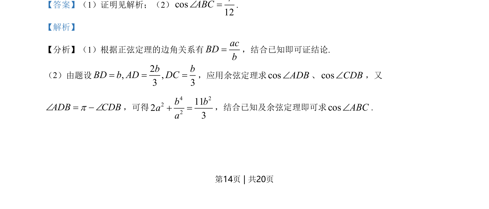
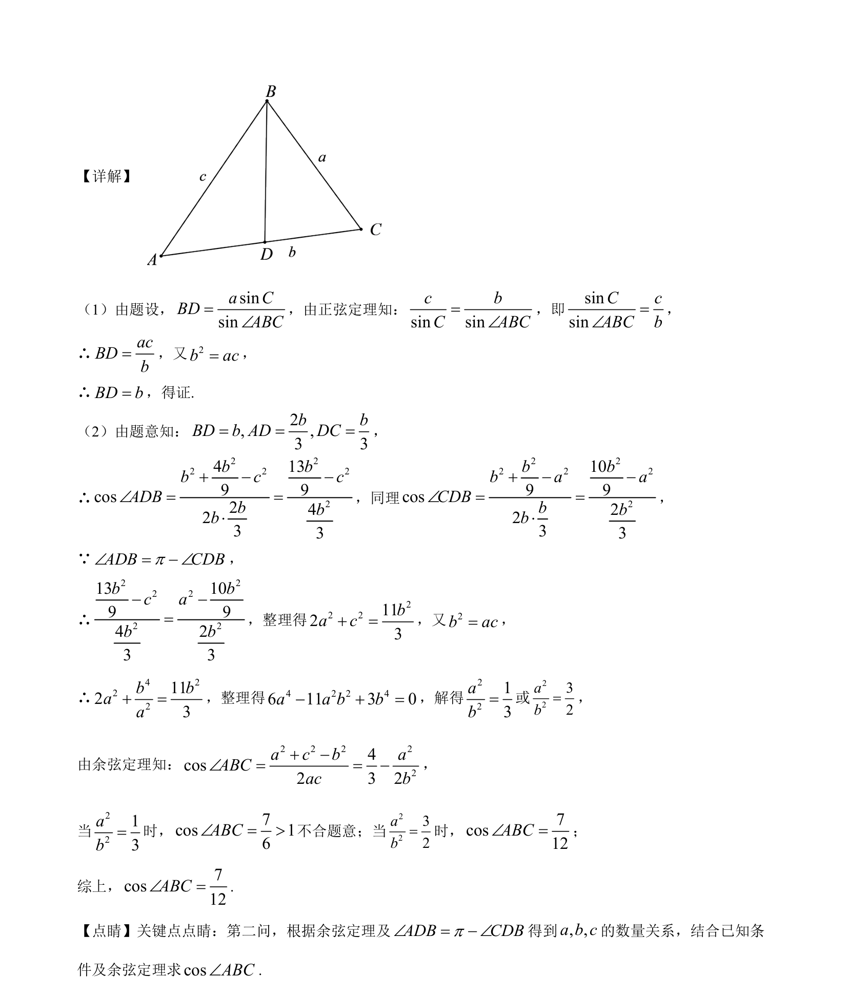

## 题面

## 摘要

该题考查利用正弦定理和余弦定理证明线段关系，并结合边长比例及代数变换求角的余弦值。

## 关联考点

- [[126-定理|正弦定理]]
- [[126-定理|余弦定理]]
- [[1368-代数化简|代数化简]]
- [[589-解三角形|解三角形]]

## 答案与解析

> 📄 原 PDF 第 14 页：`素材/真题/湖南/2008-2024·（湖南）数学高考真题/2021年高考数学试卷（新高考Ⅰ卷）（解析卷）.pdf`

<!-- 题干文本-start -->
## 题干文本
19. 记ABCV是内角A，B，C的对边分别为a，b，c.已知2b ac=，点D在边AC上，
sin sinBD ABC a CÐ =.
（1）证明：BD b=；
（2）若2AD DC=，求cosABCÐ
<!-- 题干文本-end -->

<!-- 解析文本-start -->
## 解析文本
【答案】（1）证明见解析；（2） 7cos12ABCÐ =.
【解析】
【分析】（1）根据正弦定理的边角关系有acBDb=，结合已知即可证结论.
（2）由题设 2, ,3 3b bBD b AD DC= = =，应用余弦定理求cosADBÐ、cosCDBÐ，又
ADB CDBpÐ = - Ð，可得
4 2221123b baa+ =，结合已知及余弦定理即可求cosABCÐ.
.
<!-- 解析文本-end -->
