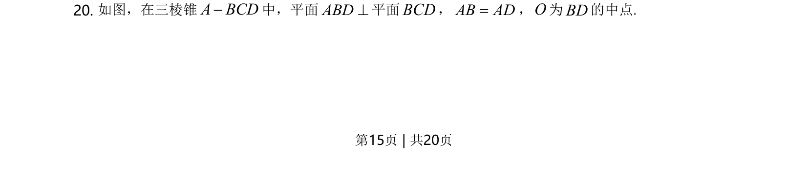
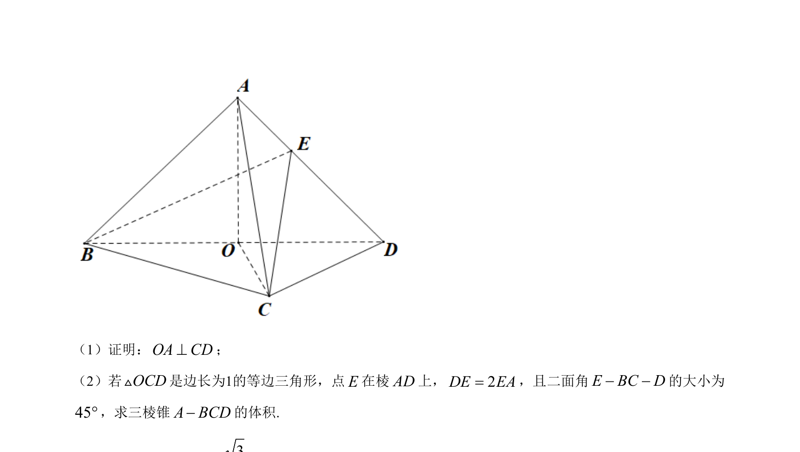
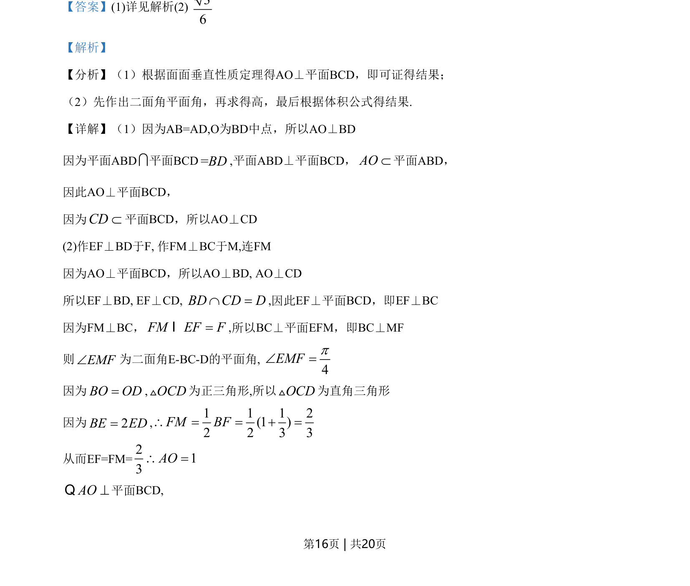
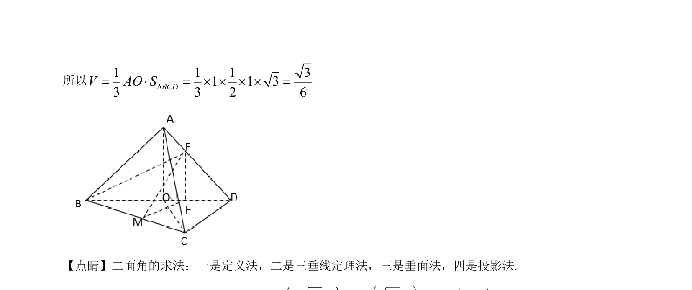

## 题面

## 摘要

该题考查面面垂直与线面垂直关系的证明，以及二面角的平面角作法和三棱锥体积计算。

## 关联考点

- [[面面垂直的性质定理]]
- [[1085-线面垂直的判定|线面垂直的判定]]
- [[二面角的平面角]]
- [[938-棱锥的体积|棱锥的体积]]

## 答案与解析

> 📄 原 PDF 第 15 页：`素材/真题/湖南/2008-2024·（湖南）数学高考真题/2021年高考数学试卷（新高考Ⅰ卷）（解析卷）.pdf`
