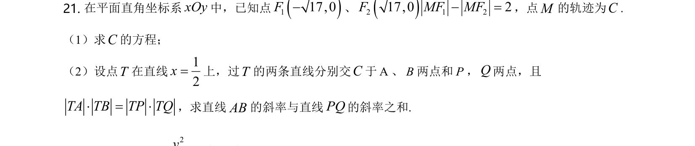
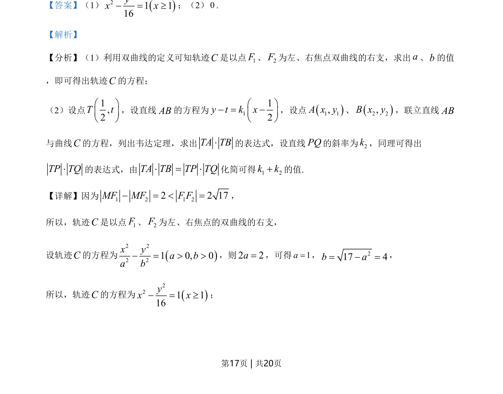
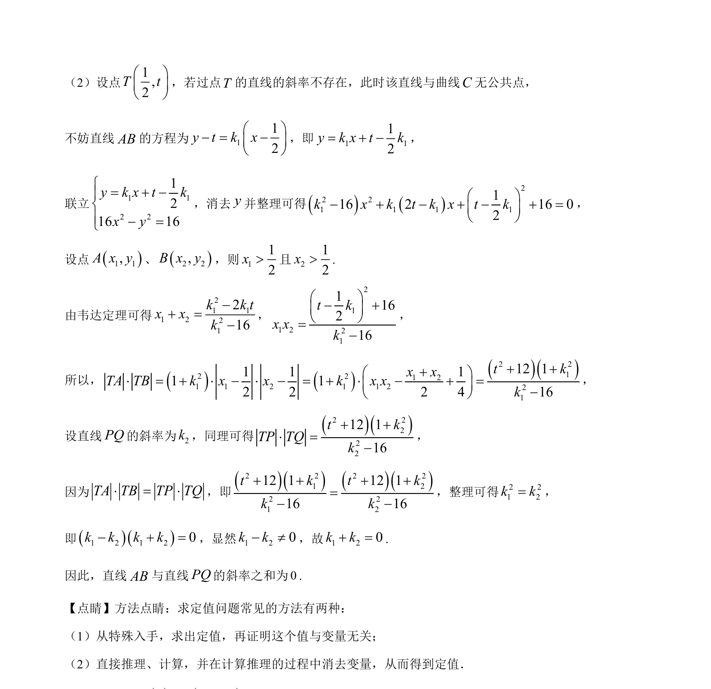

## 题面

## 摘要

考查双曲线定义求轨迹方程，直线与双曲线相交，利用韦达定理求解斜率关系。

## 关联考点

- [[730-双曲线的定义|双曲线的定义]]
- [[376-圆锥曲线轨迹问题|轨迹方程]]
- [[574-直线与圆锥曲线|直线与圆锥曲线]]
- [[234-韦达定理-初中|韦达定理]]

## 答案与解析

> 📄 原 PDF 第 17 页：`素材/真题/湖南/2008-2024·（湖南）数学高考真题/2021年高考数学试卷（新高考Ⅰ卷）（解析卷）.pdf`
