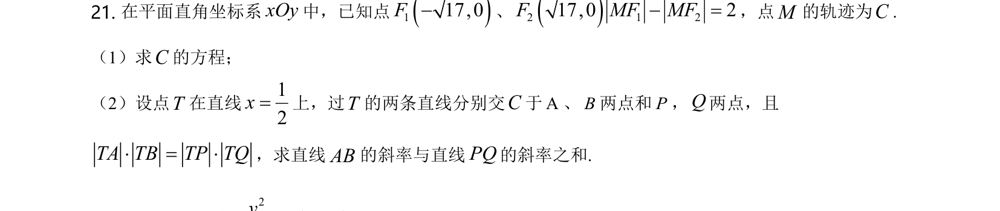
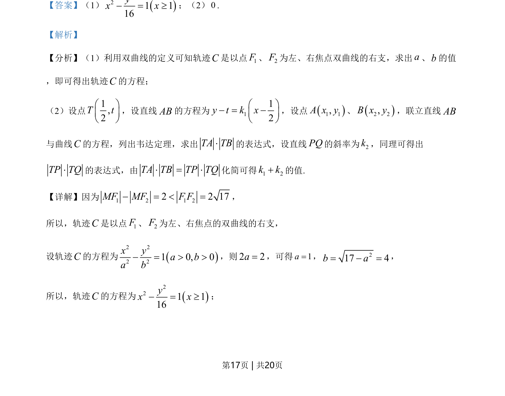
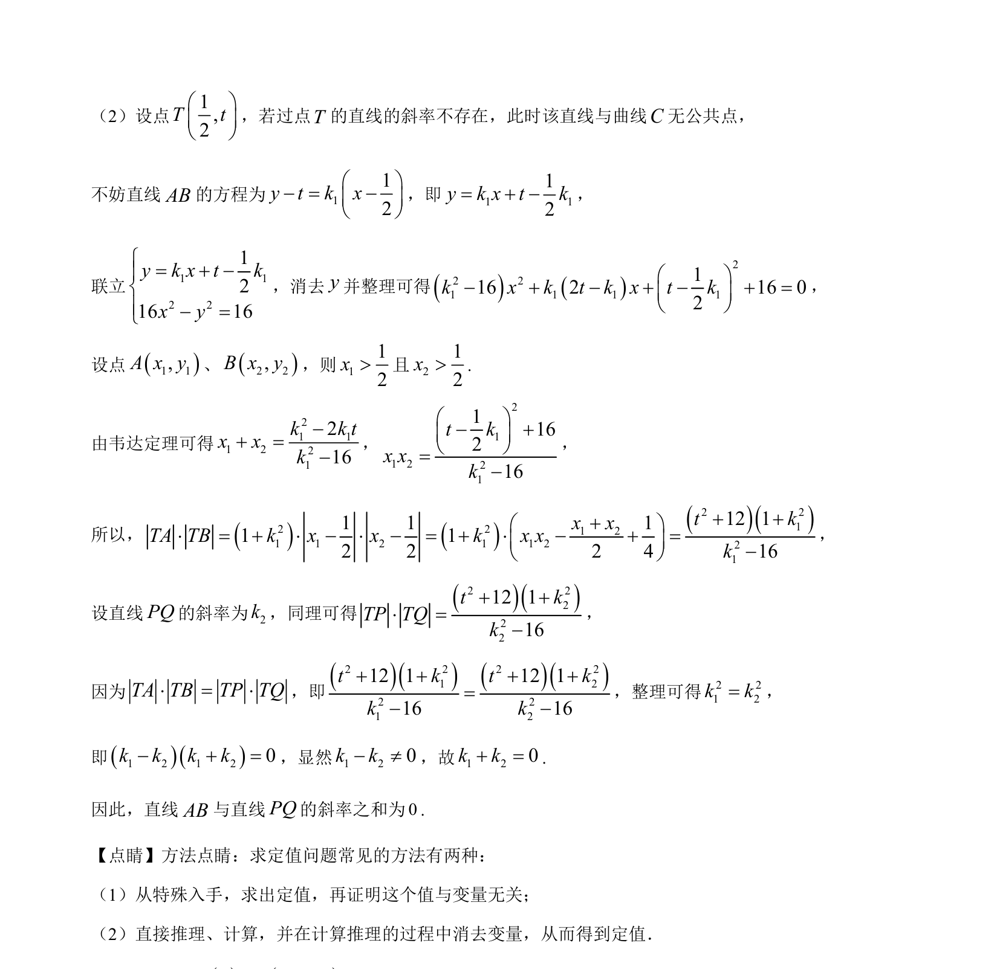

## 题面

## 摘要

考查双曲线定义求轨迹方程，直线与双曲线相交，利用韦达定理求解斜率关系。

## 关联考点

- [[730-双曲线的定义|双曲线的定义]]
- [[376-圆锥曲线轨迹问题|轨迹方程]]
- [[574-直线与圆锥曲线|直线与圆锥曲线]]
- [[234-韦达定理-初中|韦达定理]]

## 答案与解析

> 📄 原 PDF 第 17 页：`素材/真题/湖南/2008-2024·（湖南）数学高考真题/2021年高考数学试卷（新高考Ⅰ卷）（解析卷）.pdf`

<!-- 题干文本-start -->
## 题干文本
21. 在平面直角坐标系xOy中，已知点117,0F-、2 1 217,0 2F MF MF- =，点M的轨迹为C.
（1）求C的方程；
（2）设点T在直线12x=上，过T的两条直线分别交C于A、B两点和P，Q两点，且
TA TB TP TQ× = ×，求直线AB的斜率与直线PQ的斜率之和.
<!-- 题干文本-end -->

<!-- 解析文本-start -->
## 解析文本
【答案】（1）221 116yx x- = ；（2）0.
【解析】
【分析】（1）利用双曲线的定义可知轨迹C是以点1F、2F为左、右焦点双曲线的右支，求出a、b的值
，即可得出轨迹C的方程；
（2）设点
1,2T tæ öç ÷è ø
，设直线AB的方程为 112y t k xæ ö- = -ç ÷è ø
，设点1 1,A x y、2 2,B x y，联立直线AB
与曲线C的方程，列出韦达定理，求出TA TB×的表达式，设直线PQ的斜率为2k，同理可得出
TP TQ×的表达式，由TA TB TP TQ× = ×化简可得1 2k k+的值.
【详解】因为1 2 1 22 2 17MF MF F F- = < =，
所以，轨迹C是以点1F、2F为左、右焦点的双曲线的右支，
设轨迹C的方程为2 22 21 0, 0x ya ba b- = > >，则2 2a=，可得1a=， 217 4b a= - =，
所以，轨迹C的方程为221 116yx x- = ；
<!-- 解析文本-end -->
