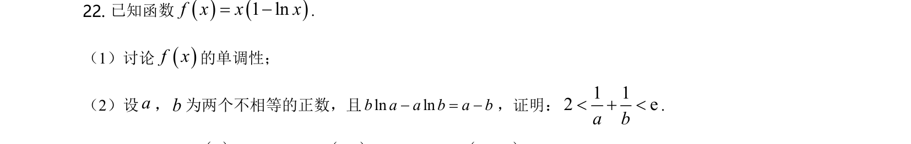
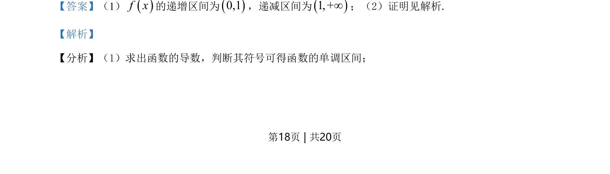
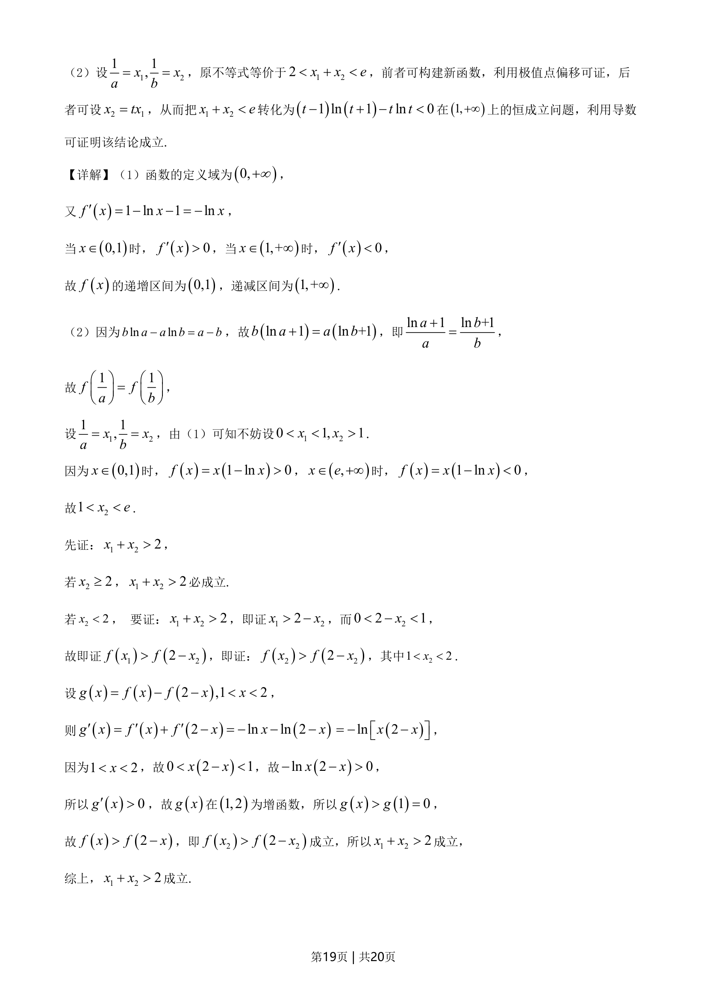
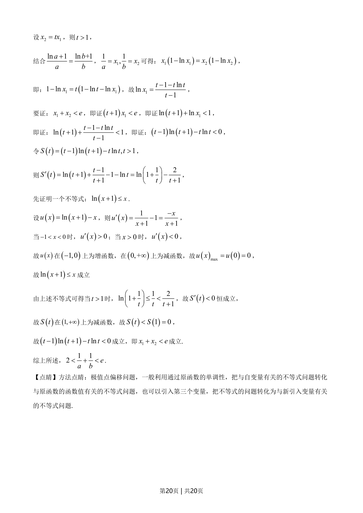

## 题面

## 摘要

本题为导数综合题，考查利用导数求单调区间及极值点偏移证明双变量不等式。

## 关联考点

- [[705-利用导数研究函数的单调性|导数与单调性]]
- [[1313-极值点偏移|极值点偏移]]
- [[构造函数证明不等式]]

## 答案与解析

> 📄 原 PDF 第 18 页：`素材/真题/湖南/2008-2024·（湖南）数学高考真题/2021年高考数学试卷（新高考Ⅰ卷）（解析卷）.pdf`
