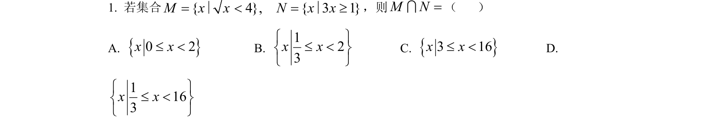
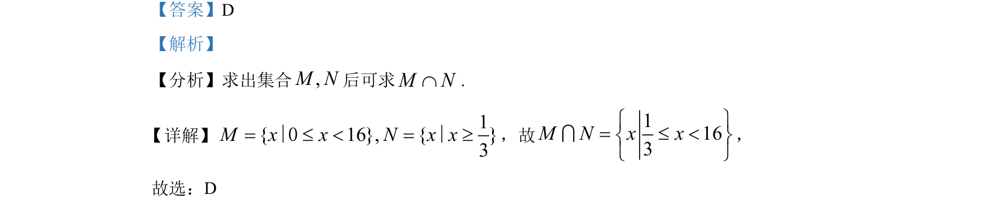

## 题面

## 摘要

本题主要考查集合交集运算及不等式解集的表示。

## 关联考点

- [[1139-集合的交集|集合的交集]]
- [[118-不等式解集|不等式解集]]

## 答案与解析

> 📄 原 PDF 第 1 页：`素材/真题/湖南/2008-2024·（湖南）数学高考真题/2022年高考数学试卷（新高考Ⅰ卷）（解析卷）.pdf`

<!-- 题干文本-start -->
## 题干文本
1. 若集合{ 4}, { 3 1 }M x x N x x= < = ³∣ ∣，则M N=I（    ）
A. {}0 2x x£ <B. 123x xì ü£ <í ýî þ
C. {}3 16x x£ <D. 
1163x xì ü£ <í ýî þ
<!-- 题干文本-end -->

<!-- 解析文本-start -->
## 解析文本
【答案】D
【解析】
【分析】求出集合,M N后可求M NÇ.
详解】 1{ 16}, { }3M x x N x x= £ < = ³∣ 0 ∣，故
1163M N x xì ü= £ <í ýî þI，
故选：D
<!-- 解析文本-end -->
