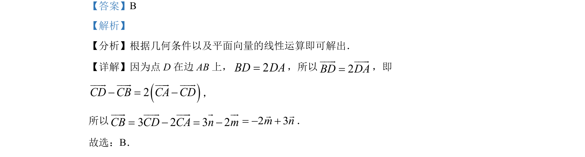

## 题面

## 摘要

利用几何条件及平面向量线性运算求解向量表示。

## 关联考点

- [[平面向量的线性运算]]
- [[322-向量的减法|向量减法]]
- [[327-向量的数乘|数乘向量]]

## 答案与解析

> 📄 原 PDF 第 2 页：`素材/真题/湖南/2008-2024·（湖南）数学高考真题/2022年高考数学试卷（新高考Ⅰ卷）（解析卷）.pdf`

<!-- 题干文本-start -->
## 题干文本
3. 在ABCV中，点 D 在边 AB上，2BD DA=．记CA m CD n= =uuu r uuu rr r，，则CBuuu r=（    ）
A. 3 2m n-r rB. 2 3m n- +r rC. 3 2m n+r rD. 
2 3m n+r r
<!-- 题干文本-end -->

<!-- 解析文本-start -->
## 解析文本
【答案】B
【解析】
【分析】根据几何条件以及平面向量的线性运算即可解出．
【详解】因为点 D 在边 AB上，2BD DA=，所以2BD DA=uuu r uuu r
，即
()2CD CB CA CD- = -uuu r uuu r uuu r uuu r
，
所以CBuuu r=3 2 3 2CD CA n m- = -uuu r uuu r r ur2 3m n= - +r r．
故选：B．
<!-- 解析文本-end -->
