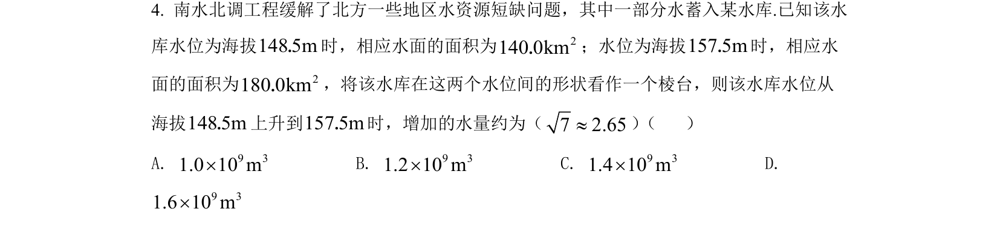
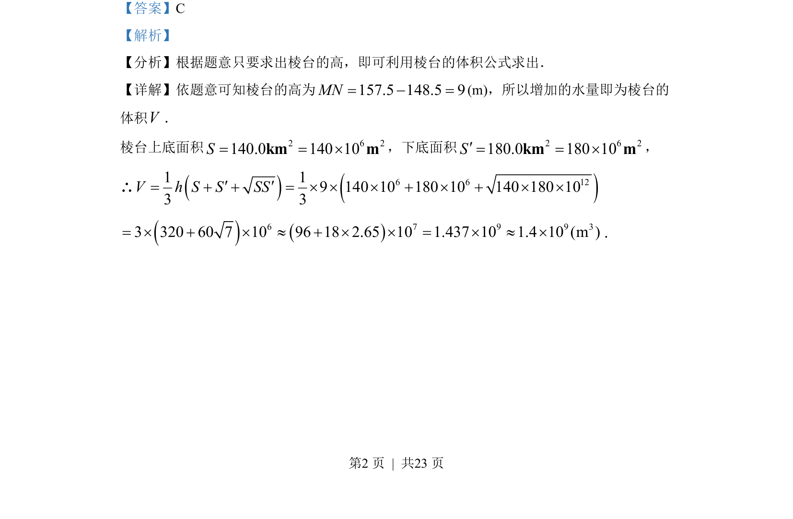

## 题面

## 摘要

依棱台体积公式计算水库增加的水量

## 关联考点

- [[739-台体体积|棱台体积]]
- [[651-体积公式|体积公式]]

## 答案与解析

> 📄 原 PDF 第 2 页：`素材/真题/湖南/2008-2024·（湖南）数学高考真题/2022年高考数学试卷（新高考Ⅰ卷）（解析卷）.pdf`

<!-- 题干文本-start -->
## 题干文本
4. 南水北调工程缓解了北方一些地区水资源短缺问题，其中一部分水蓄入某水库.已知该水
库水位为海拔148 5m．时，相应水面的面积为 2140 0km．；水位为海拔157 5m．时，相应水
面的面积为 2180 0km．，将该水库在这两个水位间的形状看作一个棱台，则该水库水位从
海拔148 5m．上升到157 5m．时，增加的水量约为（7 2.65»） （    ）
A. 9 31.0 10 m´B. 9 31.2 10 m´C. 9 31.4 10 m´D. 
9 31.6 10 m´
<!-- 题干文本-end -->

<!-- 解析文本-start -->
## 解析文本
【答案】C
【解析】
【分析】根据题意只要求出棱台的高，即可利用棱台的体积公式求出．
【详解】依题意可知棱台的高为157.5 148.5 9MN= - =(m)，所以增加的水量即为棱台的
体积V．
棱台上底面积 2 6 2140.0 140 10S= = ´km m，下底面积 2 6 2180.0 180 10S¢= = ´km m，
∴()()6 6 121 19 140 10 180 10 140 180 103 3V h S S SS= + + = ´ ´ ´ + ´ + ´ ´¢ ¢()()6 7 9 9 33 320 60 7 10 96 18 2.65 10 1.437 10 1.4 10 (m )= ´ + ´ » + ´ ´ = ´ » ´．
<!-- 解析文本-end -->
