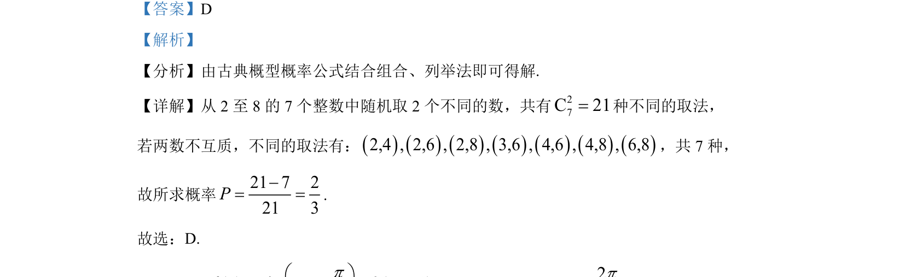

## 题面

## 摘要

从2至8的整数中随机取两个数，求两数互质的概率，采用列举法结合古典概型。

## 关联考点

- [[320-古典概型|古典概型]]
- [[505-组合概念|组合]]
- [[703-列举法|列举法]]
- [[互质]]

## 答案与解析

> 📄 原 PDF 第 3 页：`素材/真题/湖南/2008-2024·（湖南）数学高考真题/2022年高考数学试卷（新高考Ⅰ卷）（解析卷）.pdf`
