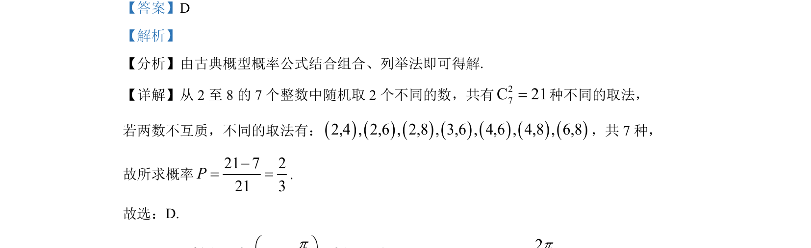

## 题面

## 摘要

从2至8的整数中随机取两个数，求两数互质的概率，采用列举法结合古典概型。

## 关联考点

- [[320-古典概型|古典概型]]
- [[505-组合概念|组合]]
- [[703-列举法|列举法]]
- [[互质]]

## 答案与解析

> 📄 原 PDF 第 3 页：`素材/真题/湖南/2008-2024·（湖南）数学高考真题/2022年高考数学试卷（新高考Ⅰ卷）（解析卷）.pdf`

<!-- 题干文本-start -->
## 题干文本
5. 从 2 至 8 的 7 个整数中随机取 2 个不同的数，则这 2 个数互质的概率为（    ）
A. 16
B. 13
C. 12D. 23
<!-- 题干文本-end -->

<!-- 解析文本-start -->
## 解析文本
【答案】D
【解析】
【分析】由古典概型概率公式结合组合、列举法即可得解.
【详解】从 2 至 8 的 7 个整数中随机取 2 个不同的数，共有27C 21=种不同的取法，
若两数不互质，不同的取法有：2,4 , 2,6 , 2,8 , 3,6 , 4,6 , 4,8 , 6,8，共 7 种，
故所求概率21 7 221 3P-= =.
故选：D.
<!-- 解析文本-end -->
